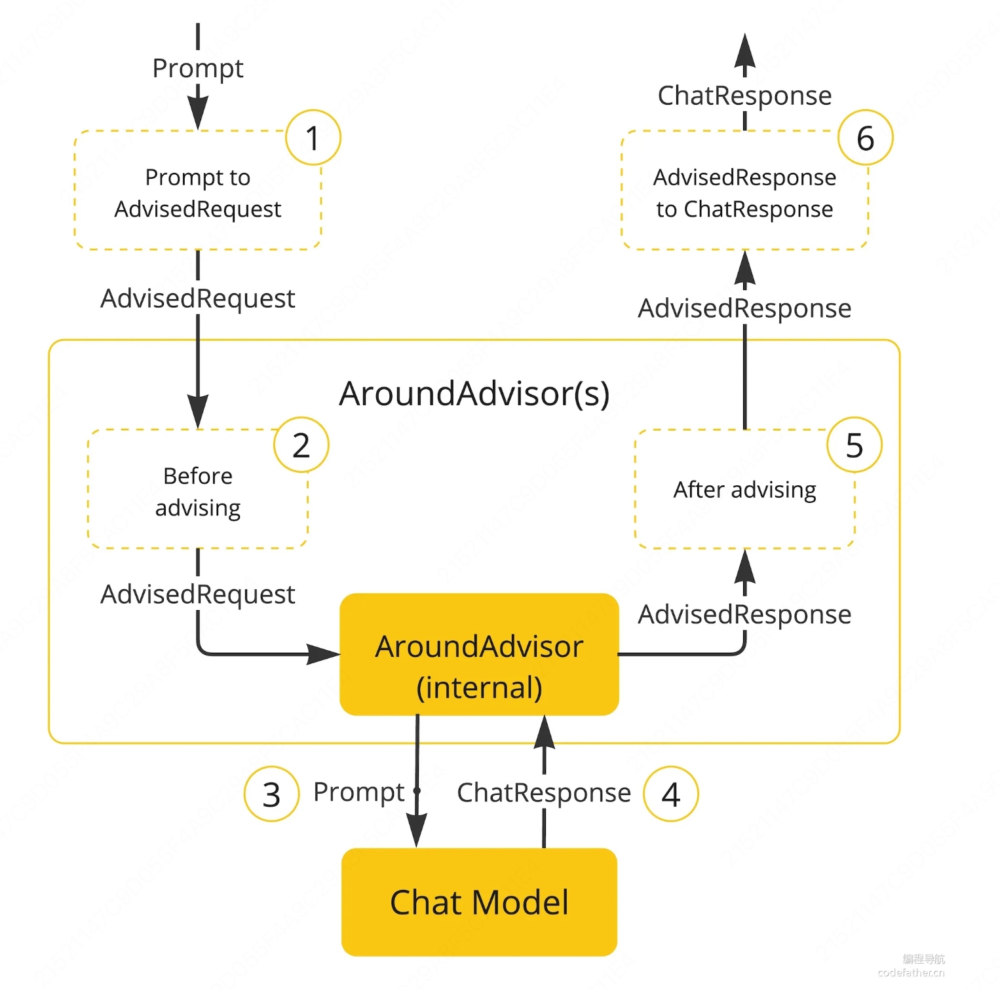
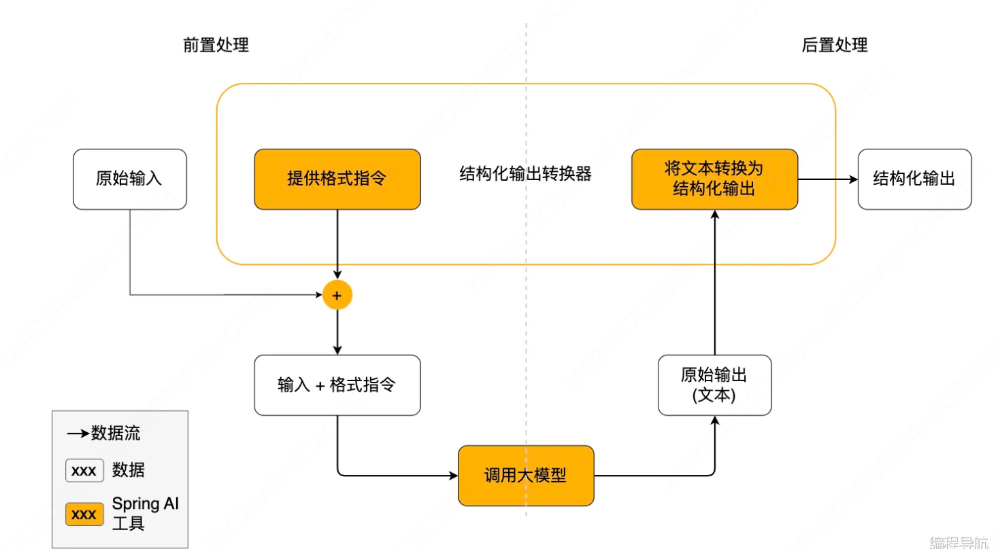
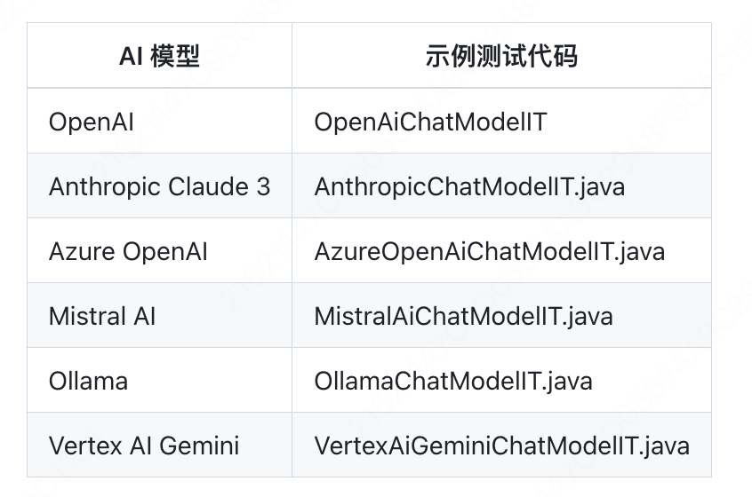

# ai项目相关学习笔记


# ChatClient特性
### ChatModel和ChatClient区别

#### 基础用法(ChatModel)
```ChatResponse response = chatModel.call(new Prompt("你好"));```
#### 高级用法(ChatClient)
```
ChatClient chatClient = ChatClient.builder(chatModel)
.defaultSystem("你是恋爱顾问")
.build();

String response = chatClient.prompt().user("你好").call().content();
```
chatclient适合更复杂的链式调用

#### spring提供的chatclinet构造方法

```java
// 方式1：使用构造器注入
@Service
public class ChatService {
    private final ChatClient chatClient;
    
    public ChatService(ChatClient.Builder builder) {
        this.chatClient = builder
            .defaultSystem("你是恋爱顾问")
            .build();
    }
}

// 方式2：使用建造者模式
ChatClient chatClient = ChatClient.builder(chatModel)
    .defaultSystem("你是恋爱顾问")
    .build();

```

#### spring提供clent的多种响应方式

```java
// ChatClient支持多种响应格式
// 1. 返回 ChatResponse 对象（包含元数据如 token 使用量）
ChatResponse chatResponse = chatClient.prompt()
    .user("Tell me a joke")
    .call()
    .chatResponse();

// 2. 返回实体对象（自动将 AI 输出映射为 Java 对象）
// 2.1 返回单个实体
record ActorFilms(String actor, List<String> movies) {}
ActorFilms actorFilms = chatClient.prompt()
    .user("Generate the filmography for a random actor.")
    .call()
    .entity(ActorFilms.class);

// 2.2 返回泛型集合
List<ActorFilms> multipleActors = chatClient.prompt()
    .user("Generate filmography for Tom Hanks and Bill Murray.")
    .call()
    .entity(new ParameterizedTypeReference<List<ActorFilms>>() {});

// 3. 流式返回（适用于打字机效果）
Flux<String> streamResponse = chatClient.prompt()
    .user("Tell me a story")
    .stream()
    .content();

// 也可以流式返回ChatResponse
Flux<ChatResponse> streamWithMetadata = chatClient.prompt()
    .user("Tell me a story")
    .stream()
    .chatResponse();

```
#### 给ChatClient设置默认参数

```java
// 定义默认系统提示词
ChatClient chatClient = ChatClient.builder(chatModel)
        .defaultSystem("You are a friendly chat bot that answers question in the voice of a {voice}")
        .build();

// 对话时动态更改系统提示词的变量
chatClient.prompt()
        .system(sp -> sp.param("voice", voice))
        .user(message)
        .call()
        .content());

```

# Advisors 顾问

---
[advisors](https://docs.spring.io/spring-ai/reference/api/advisors.html)
---

SpringAl使用Advisors (顾问)机制来增强AI的能力，可以理解为一一系列可插拔的拦截器,在调用AI前和调用AI后可以执行一些额外的操作，
比如:

前置增强:调用AI前改写一下Pronnpt提示词、检查一下提示词是否安全

后置增强:调用AI后记录一下日志、处理一下返回的结果

为了便于大家理解，后续教程中我可能会经常叫它为拦截器。
用法很简单，我们可以直接为ChatClient指定默认拦截器，比如对话记忆兰截器MessageChatMemoryAdvisor 可以帮助我们实现多轮对话能力，省去了自己维护对话列表的麻烦。

```java
var chatClient = ChatClient.builder(chatModel)
    .defaultAdvisors(
        new MessageChatMemoryAdvisor(chatMemory), // 对话记忆 advisor
        new QuestionAnswerAdvisor(vectorStore)    // RAG 检索增强 advisor
    )
    .build();

String response = this.chatClient.prompt()
    // 对话时动态设定拦截器参数，比如指定对话记忆的 id 和长度
    .advisors(advisor -> advisor.param("chat_memory_conversation_id", "678")
            .param("chat_memory_response_size", 100))
    .user(userText)
    .call()
	.content();


```
advisors原理如下


解释上图的执行流程

1.Spring AI框架从用户的Prompt 创建一个AdvisedRequest,同时创建一个空的AdvisorContext 对象，用于传递信息。

2.链中的每个advisor处理这个请求，可能会对其进行修改。或者，它也可以选择不调用下一个实体来阻止请求继续传递，这时该advisor负责填充响应内容。

3.由框架提供的最终advisor将请求发送给聊天模型 ChatModel。

4.聊天模型的响应随后通过 advisor 链传回，并被转换为AdvisedResponse。后者包含了共享的AdvisorContext实例。

5.每个advisor都可以处理或修改这个响应。

6.最终的AdvisedResponse 通过提取 ChatCompletion返回给客户端。

实际开发中，往往我们会用到多个拦截器，组合在一起相当于一条拦截器链条(责任链模式的设计思想)。
每个拦截器是有顺序的，通过 getorder()方法获取到顺序，得到的值越低，越优先执行。

比如下面的代码中，如果单独按照代码顺序，可能我们会认为:将首先执行MessageChatMemoryAdvisor，将对话历史记录添加到提示词中。然后，QuestionAnswerAdvisor将根据用户的问题和添加的对话历史记录执行知识库检索，从而提供更相关的结果:

```java
var chatClient = ChatClient.builder(chatModel)
    .defaultAdvisors(
        new MessageChatMemoryAdvisor(chatMemory), // 对话记忆 advisor
        new QuestionAnswerAdvisor(vectorStore)    // RAG 检索增强 advisor
    )
    .build();

```
## 对话记忆顾问 Chat Memory Advisor


前面我们提到了，想要实现对话记忆功能，可以使用SpringAI的ChatMemoryAdvisor，它主要有几种内置的实现方式:

**MessageChatMemoryAdvisor**:从记忆中检索历史对话，并将其作为消息集合添加到提示词中

**PromptChatMemoryAdvisor**:从记忆中检索历史对话，并将其添加到提示词的系统文本中

**VectorStoreChatMemoryAdvisor**:可以用向量数据库来存储检索历史对话

MessageChatMemoryAdvisor 和PromptChatMemoryAdvisor 用法类似， 但是略有一些区别:
 
MessageChatMemoryAdvisor将对话历史作为一系列独立的消息添加到提示中，保留原始对话的完整结构，包括每条消息的角色标识(用户、助手、系统)。
```java
[
  {"role": "user", "content": "你好"},
  {"role": "assistant", "content": "你好！有什么我能帮助你的吗？"},
  {"role": "user", "content": "讲个笑话"}
]

```
PromptChatMemoryAdvisor将对话历史添加到提示词的系统文本部分，因此可能会失去原始的消息边界。
```java
以下是之前的对话历史：
用户: 你好
助手: 你好！有什么我能帮助你的吗？
用户: 讲个笑话

现在请继续回答用户的问题。
```
一般情况下，更建议使用 MessageChatMemoryAdvisor。更符合大多数现代LLM的对话模型设计，能更好地保持上下文连贯性。
## Chat Memory
上述 ChatMemoryAdvisor 都依赖Chat Memory进行构造，Chat Memory负责历史对话的存储，定义了保存消息、查询消息、清空消息历史的方法。


SpringAI内置了几种 Chat Memory，可以将对话保存到不同的数据源中，
比如:

**InMemoryChatMemory**:内存存储

**CassandraChatMemory**:在Cassandra中带有过期时间的持久化存储

**Neo4jChatMemory**:在Neo4j中没有过期时间限制的持久化存储

**JdbcChatMemory**:在JDBC中没有过期时间限制的持久化存储

当然也可以通过实现ChatMemory接口自定义数据源的存储


## **自定义advisor**

接下来鱼皮带大家实战一些SpringAI的实用特性，包括自定义Advisor、结构化输出、对话记忆持久化、Prompt模板和多模态。
自定义Advisor
学过Servlet 和 Spring AOP的同学应该对这个功能并不陌生，我们可以通过编写拦截器或切面对请求和响应进行处理，比如记录请求响应日志、鉴权等。
SpringAI的Advisor就可以理解为拦截器，可以对调用AI的请求进行增强，比如调用AI前鉴权、调用AI后记录日志。
官方已经提供了一些Advisor，但可能无法满足我们实际的业务需求，这时我们可以使用官方提供的自定义Advisor功能。按照下列步骤操作即可。
自定义Advisor步骤
1)选择合适的接口实现，实现以下接口之一或同时实现两者(更建议同时实现):
·CallAroundAdvisor:用于处理同步请求和响应(非流式)
StreamAroundAdvisor:用于处理流式请求和响应

```java
public class MyCustomAdvisor implements CallAroundAdvisor, StreamAroundAdvisor {
    // 实现方法...
}
```
实现核心方法

对于非流式
```java
@Override
public AdvisedResponse aroundCall(AdvisedRequest advisedRequest, CallAroundAdvisorChain chain) {
    // 1. 处理请求（前置处理）
    AdvisedRequest modifiedRequest = processRequest(advisedRequest);
    
    // 2. 调用链中的下一个Advisor
    AdvisedResponse response = chain.nextAroundCall(modifiedRequest);
    
    // 3. 处理响应（后置处理）
    return processResponse(response);
}
```
对于流式
```java
@Override
public Flux<AdvisedResponse> aroundStream(AdvisedRequest advisedRequest, StreamAroundAdvisorChain chain) {
    // 1. 处理请求
    AdvisedRequest modifiedRequest = processRequest(advisedRequest);
    
    // 2. 调用链中的下一个Advisor并处理流式响应
    return chain.nextAroundStream(modifiedRequest)
               .map(response -> processResponse(response));
}
```
设置执行顺序和名字
```java
@Override
public int getOrder() {
    // 值越小优先级越高，越先执行
    return 100; 
}

@Override
public String getName() {
    return "鱼皮自定义的 Advisor";
}

```
### 日志advisor
```java
/**
 * 自定义日志 Advisor
 * 打印 info 级别日志、只输出单次用户提示词和 AI 回复的文本
 */
@Slf4j
public class MyLoggerAdvisor implements CallAroundAdvisor, StreamAroundAdvisor {

    @Override
    public String getName() {
        return this.getClass().getSimpleName();
    }

    @Override
    public int getOrder() {
        return 0;
    }

    private AdvisedRequest before(AdvisedRequest request) {
        log.info("AI Request: {}", request.userText());
        return request;
    }

    private void observeAfter(AdvisedResponse advisedResponse) {
        log.info("AI Response: {}", advisedResponse.response().getResult().getOutput().getText());
    }

    public AdvisedResponse aroundCall(AdvisedRequest advisedRequest, CallAroundAdvisorChain chain) {
        advisedRequest = this.before(advisedRequest);
        AdvisedResponse advisedResponse = chain.nextAroundCall(advisedRequest);
        this.observeAfter(advisedResponse);
        return advisedResponse;
    }

    public Flux<AdvisedResponse> aroundStream(AdvisedRequest advisedRequest, StreamAroundAdvisorChain chain) {
        advisedRequest = this.before(advisedRequest);
        Flux<AdvisedResponse> advisedResponses = chain.nextAroundStream(advisedRequest);
        return (new MessageAggregator()).aggregateAdvisedResponse(advisedResponses, this::observeAfter);
    }
}

```
注意这个只是一个读,不能修改响应

## 自定义 Re-reading Adviser

让我们再参考官方文档来实现一个Re-Reading(重读)Advisor，又称Re2。该技术通过让模型重新阅读问题来提高推理能力，有文献来印证它的效果。
?注意，虽然该技术可提高大语言模型的推理能力，不过成本会加倍!所以如果AI应用要面向C端开放，不建议使用。
Re2的实现原理很简单，改写用户Prompt为下列格式，也就是让AI重复阅读用户的输入:
```java
{Input_Query}
Read the question again: {Input_Query}
```
```java
/**
 * 自定义 Re2 Advisor
 * 可提高大型语言模型的推理能力
 */
public class ReReadingAdvisor implements CallAroundAdvisor, StreamAroundAdvisor {


    private AdvisedRequest before(AdvisedRequest advisedRequest) {

        Map<String, Object> advisedUserParams = new HashMap<>(advisedRequest.userParams());
        advisedUserParams.put("re2_input_query", advisedRequest.userText());

        return AdvisedRequest.from(advisedRequest)
                .userText("""
                        {re2_input_query}
                        Read the question again: {re2_input_query}
                        """)
                .userParams(advisedUserParams)
                .build();
    }

    @Override
    public AdvisedResponse aroundCall(AdvisedRequest advisedRequest, CallAroundAdvisorChain chain) {
        return chain.nextAroundCall(this.before(advisedRequest));
    }

    @Override
    public Flux<AdvisedResponse> aroundStream(AdvisedRequest advisedRequest, StreamAroundAdvisorChain chain) {
        return chain.nextAroundStream(this.before(advisedRequest));
    }

    @Override
    public int getOrder() {
        return 0;
    }

    @Override
    public String getName() {
        return this.getClass().getSimpleName();
    }
}

```

## 最佳实践

最佳实践

1)保持单一职责:每个Advisor应专注于一项特定任务

2)注意执行顺序:合理设置getorder()值确保Advisor按正确顺序执行3)同时支持流式和非流式:尽可能同时实现两种接口以提高灵活性

4)高效处理请求:避免在Advisor中执行耗时操作

5)测试边界情况:确保Advisor能够优雅处理异常和边界情况

6)对于需要更复杂处理的流式场景，可以使用Reactor的操作符:
```java
@Override
public Flux<AdvisedResponse> aroundStream(AdvisedRequest advisedRequest, StreamAroundAdvisorChain chain) {
    return Mono.just(advisedRequest)
           .publishOn(Schedulers.boundedElastic())
           .map(request -> {
               // 请求前处理逻辑
               return modifyRequest(request);
           })
           .flatMapMany(request -> chain.nextAroundStream(request))
           .map(response -> {
               // 响应处理逻辑
               return modifyResponse(response);
           });
}

```
7)可以使用 adviseContext在 Advisor 链中共享状态:
```java
// 更新上下文
advisedRequest = advisedRequest.updateContext(context -> {
    context.put("key", "value");
    return context;
});

// 读取上下文
Object value = advisedResponse.adviseContext().get("key");

```
## 结构化输出

[结构化输出转换器](https://docs.spring.io/spring-ai/reference/api/structured-output-converter.html)(Structured Output Converter)是Spring AI提供的一种实用机制，用于将大语言模型返回的文本输出转换为结构化数据格式，如JSON、XML或Java类，这对于需要可靠解析AI输出值的下游应用程序非
常重要。
比如之前鱼皮在编程导航的智能B1项目，就需要让AI生成前端可视化图表的JSON格式代码，只不过之前我们是自己通过写Prompt实现的，而SpringAI直接提供了该功能。
### 基本原理-工作流程
结构化输出转换器在大模型调用前后都发挥作用:

调用前:转换器会在提示词后面附加格式指令，明确告诉模型应该生成何种结构的输出，引导模型生成符合指定格式的响应。

调用后:转换器将模型的文本输出转换为结构化类型的实例，比如将原始文本映射为JSON、XML或特定的数据结构。



注意，结构化输出转换器只是尽最大努力将模型输出转换为结构化数据，AI模型不保证一定按照要求返回结构化输出。有些模型可能无法理解提示词或无法按要求生成结构化输出。建议在程序中实现验证机制或者异常处理机制来确保模型输出符合预期。
## 进阶原理-API设计
让我们进一步理解结构化输出的原理，结构化输出转换器Structuredoutputconverter接口允许开发者获取结构化输出，例如将输出映射到Java类或值数组。接口定义如下:

```java
public interface StructuredOutputConverter<T> extends Converter<String, T>, FormatProvider {

}
```
它集成了2个关键接口:

FormatProvider 接口:提供特定的格式指令给AI模型

Spring的Converter<String，T>接口:负责将模型的文本输出转换为指定的目标类型T
```java
public interface FormatProvider {
    String getFormat();
}

```
SpringAI提供了多种转换器实现，分别用于将输出转换为不同的结构:

**AbstractConversionServiceOutputConverter**:提供预配置的 GenericConversionService,用于将 LLM 输出转换为所需格式

**AbstractMessageOutputConverter**: 支持 Spring AI Message 的转换

**BeanOutputConverter**:用于将输出转换为 Java Bean 对象(基于ObjectMapper 实现)

**MapOutputConverter**:用于将输出转换为Map结构

**ListOutputConverter**:用于将输出转换为List 结构


### 了解了API设计后，再来进一步剖析一遍结构化输出的工作流程。

1) 在调用大模型之前，FormatProvider为AI模型提供特定的格式指令，使其能够生成可以通过Converter转换为指定目标类型的文本输出。
转换器的格式指令组件会将类似下面的格式指令附加到提示词中:
```java
Your response should be in JSON format.
The data structure for the JSON should match this Java class: java.util.HashMap
Do not include any explanations, only provide a RFC8259 compliant JSON response following this format without deviation.

```
通常，使用 PromptTemplate将格式指令附加到用户输入的末尾，示例代码如下:
```java

StructuredOutputConverter outputConverter = ...
String userInputTemplate = """
        ... 用户文本输入 ....
        {format}
        """; // 用户输入，包含一个“format”占位符。
Prompt prompt = new Prompt(
        new PromptTemplate(
                this.userInputTemplate,
                Map.of(..., "format", outputConverter.getFormat()) // 用转换器的格式替换“format”占位符
        ).createMessage());

```
2) Converter 负责将模型的输出文本转换为指定类型的实例。

### 使用示例
1) BeanOutputConverter 示例，将AI输出转换为自定义 Java类:
```java
// 定义一个记录类
record ActorsFilms(String actor, List<String> movies) {}

// 使用高级 ChatClient API
ActorsFilms actorsFilms = ChatClient.create(chatModel).prompt()
        .user("Generate 5 movies for Tom Hanks.")
        .call()
        .entity(ActorsFilms.class);

```
或者
```java
// 可以转换为对象列表
List<ActorsFilms> actorsFilms = ChatClient.create(chatModel).prompt()
        .user("Generate the filmography of 5 movies for Tom Hanks and Bill Murray.")
        .call()
        .entity(new ParameterizedTypeReference<List<ActorsFilms>>() {});

```
2) MapOutputConverter 示例，将模型输出转换为包含数字列表的Map:
```java
Map<String, Object> result = ChatClient.create(chatModel).prompt()
        .user(u -> u.text("Provide me a List of {subject}")
                    .param("subject", "an array of numbers from 1 to 9 under they key name 'numbers'"))
        .call()
        .entity(new ParameterizedTypeReference<Map<String, Object>>() {});

```
3) ListOutputConverter示例，将模型输出转换为字符串列表:
```java
List<String> flavors = ChatClient.create(chatModel).prompt()
                .user(u -> u.text("List five {subject}")
                            .param("subject", "ice cream flavors"))
                .call()
                .entity(new ListOutputConverter(new DefaultConversionService()));
```
---
### 支持的AI模型
根据[官方文档](https://docs.spring.io/spring-ai/reference/api/structured-output-converter.html#_supported_ai_models)，以下AI模型已经过测试，支持List、Map和Bean结构化输出:

值得一提的是，一些AI模型提供了专门的内置JSON模式，用于生成结构化的JSON输出，大家无需关注实现细节，只需要知道:内置JSON模式可以确保模型生成的响应严格符合JSON格式，提高结构化输出的可靠性。

OpenAI:提供了JSON_0BJECT 和JSON_SCHEMA 响应格式选项

Azure OpenAl:通过设置{"type":"json_object"} 启用 JSON模式

Ollama:提供format 选项，目前接受的唯一值是json

Mistral Al:提供responseFormat 选项，设置为{"type":"json_object"}启用 JSON模式

### 最佳实践
1) 尽量为模型提供清晰的格式指导
2) 实现输出验证机制和异常处理逻辑，确保结构化数据符合预期
3) 选择支持结构化输出的合适模型
4) 对于复杂数据结构，考虑使用 ParameterizedTypeReference

## 对话记忆持久化

之前我们使用了基于内存的对话记忆来保存对话上下文，但是服务器一旦重启了，对话记忆就会丢失。有时，我们可能希望将对话记忆持久化，保存到文件、数据库、Redis或者其他对象存储中，怎么实现呢?
Spring AI提供了2种方式。

### 利用现有依赖实现

前面提到，[官方提供](https://docs.spring.io/spring-ai/reference/api/chatclient.html#_chat_memory)了一些第三方数据库的整合支持，可以将对话保存到不同的数据源中。比如:
**InMemoryChatMemory**:内存存储

**CassandraChatMemory**:在Cassandra中带有过期时间的持久化存储

**Neo4jChatMemory**:在Neo4j中没有过期时间限制的持久化存储

**JdbcChatMemory**:在JDBC中没有过期时间限制的持久化存储

如果我们要将对话持久化到数据库中，就可以使用JdbcChatMemory。但是 spring-ai-starter-model-chat-memory-jdbc依赖目前版本很少，而且缺乏相关介绍，Maven官方仓库也搜不到依赖，所以不推荐使用。
Spring仓库倒是能搜到，但用的人太少了，神特么开荒!

因此我会更建议大家自定义实现ChatMemory。
### 自定义实现
SpringAI的对话记忆实现非常巧妙，解耦了"存储”和"记忆算法”，使得我们可以单独修改ChatMemory存储来改变对话记忆的保存位置，而无需修改保存对话记忆的流程。
虽然官方文档没有给我们提供自定义ChatMemory实现的示例，但是我们可以直接去阅读默认实现类InMemoryChatMemory的源码，有样学样呀!
ChatMemory接口的方法并不多，需要实现对话消息的增、查、删:

参考 InMemoryChatMemory 的源码，其实就是通过 ConcurrentHashMap来维护对话信息，key是对话id(相当于房间号)，value是该对话id对应的消息列表。

#### 自定义文件持久化 ChatMemory

由于数据库持久化还需要引入额外的依赖，比较麻烦，这也不是本项目学习的重点，因此我们就实现一个基于文件读写的ChatMemory。
虽然需要实现的接口不多，但是实现起来还是有一定复杂度的，一个最主要的问题是消息和文本的转换。我们在保存消息时，要将消息从Message对象转为文件内的文本;读取消息时，要将文件内的文本转换为Message对象。也就是对象的序列化和反序列化。
我们本能地会想到通过JSON进行序列化，但实际操作中，我们发现这并不容易。原因是:
1) 要持久化的 Message是一个接口，有很多种不同的子类实现(比如 UserMessage、SystemMessage等
2) 每种子类所拥有的字段都不一样，结构不统一 
3) 子类没有无参构造函数，而且没有实现Serializable序列化接口

# PromptTemplate 模板
## 什么是PromptTemplate?有什么用?
PromptTemplate是SpringAI框架中用于构建和管理提示词的核心组件。允许开发者创建带有占位符的文本模板，然后在运行时动态替换这些占位符。
它相当于AI交互中的“视图层"，类似于Spring MVC中的视图模板(或者JSP)。通过使用PromptTemplate，你可以更加结构化、可维护地管理AI应用中的提示词，使其更易于优化和扩展，同时降低硬编码带来的维护成本。
PromptTemplate最基本的功能是支持变量替换。你可以在模板中定义占位符，然后在运行时提供这些变量的值:

```java
// 定义带有变量的模板
String template = "你好，{name}。今天是{day}，天气{weather}。";

// 创建模板对象
PromptTemplate promptTemplate = new PromptTemplate(template);

// 准备变量映射
Map<String, Object> variables = new HashMap<>();
variables.put("name", "鱼皮");
variables.put("day", "星期一");
variables.put("weather", "晴朗");

// 生成最终提示文本
String prompt = promptTemplate.render(variables);
// 结果: "你好，鱼皮。今天是星期一，天气晴朗。"
```
模板的思路在编程技术中经常用到，比如数据库的预编译语句、记录日志时的变量占位符、模板引擎等。
PromptTemplate在以下场景特别有用:
1) 动态个性化交互:根据用户信息、上下文或业务规则定制提示词
2) 多语言支持:使用相同的变量但不同的模板文件支持多种语言
3) A/B测试:轻松切换不同版本的提示词进行效果对比
4) 提示词版本管理:将提示词外部化，便于版本控制和迭代优化

**实现原理**

PromptTemplate底层使用了OSS StringTemplate 引擎，这是一个强大的模板引擎，专注于文本生成。在SpringAI中，PromptTemplate类实现了以下接口:

```java
public class PromptTemplate implements PromptTemplateActions, PromptTemplateMessageActions {
    // 实现细节
}

```
### 专用模板类
SpringAI提供了几种专用的模板类，对应不同角色的消息:
1) SystemPromptTemplate:用于系统消息，设置AI的行为和背景
2) AssistantPromptTemplate:用于助手消息，用于设置AI回复的结构
3) FunctionPromptTemplate: 目前没用
```java
String userText‏‏‏ = """
    Tell me about three famous pirates from the Golden Age of Piracy and why they d‍‍‍id.
    Write at least a sente⁡⁡⁡nce for each pirate.
    """;

Message userMessage = new UserMessage(userText);

String sy‏‏‏stemText = """
  You are a helpful AI assistant tha‍‍‍t helps people fi⁡⁡⁡nd information.
  Your name is {name}
  You should reply to the user's request with your name and also in the style of a {voice}.
  """;

SystemPromptTemplate systemPromptTemplate = new SystemPromptTemplate(systemText);
Message systemMessage = systemPromptTemplate.createMessage(Map.of("name", name, "voice", voice));

Prompt prompt = new Prompt(List.of(userMessage, systemMessage));

List<Generation> response = chatModel.call(prompt).getResults();

```
### 从文件加载模板
PromptTemplate 支持从外部文件加载模板内容，很适合管理复杂的提示词。Spring AI利用 Spring的Resource
对象来从指定路径加载模板文件:
```java
// 从类路径资源加载系统提示模板
@Value("classpath:/prompts/system-message.st")
private Resource systemResource;

// 直接使用资源创建模板
SystemPromptTemplate systemPromptTemplate = new SystemPromptTemplate(systemResource);
```

这种方式让你可以:
1) 将复杂的提示词放在单独的文件中管理。
2) 在不修改代码的情况下调整提示词
3) 为不同场景准备多套提示词模板

是不是有点像写配置文件?有点儿前后端分离的感觉了?我也会更推荐大家使用这种方式来管理Prompt模板。
# 多模态
AI多模态是指能够同时处理、理解和生成多种不同类型数据的能力，比如文本、图像、音频、视频、PDF、结构化数据(比如表格)等。
还有一个概念叫“原生多模态大模型”，是指在架构设计和预训练阶段就直接整合多种数据类型的AI模型，可以使用单一模型同时处理多种模态数据，而非将多个单模态模型简单组合在一起。比如OpenAIGPT-4o、Google Vertex Al Gemini 1.5, Anthropic Claude3 等.
原生多模态大模型可以在整个模型中共享特征和学习策略，有助于捕获跨模态特征间的复杂关系。所以它们通常在执行跨模态任务时表现更好，比如图文匹配、视觉问答或多模态翻译。
下面分享2种多模态开发的方法。
## 1、Spring AI多模态开发
SpringAI提供了[多模态开发](https://docs.spring.io/spring-ai/reference/api/multimodality.html)的支持，但是要注意很多模型是不支持多模态的，所以在开发前一定要查看[支持多模态的模型文档](https://docs.spring.io/spring-ai/reference/api/multimodality.html#_supported_ai_models)。
目前多模态能力较强的模型有Google VertexAI Gemini和 OpenAl:

选择大模型后，可以参考对应的官方文档来了解多模态的开发方式，比如VertexAI文档允许在发送给AI的消息中包含图片等资源，示例代码如下:

```java
byte[] data = new ClassPathResource("/vertex-test.png").getContentAsByteArray();

var userMessage = new UserMessage("Explain what do you see on this picture?",
        List.of(new Media(MimeTypeUtils.IMAGE_PNG, this.data)));

ChatResponse response = chatModel.call(new Prompt(List.of(this.userMessage)));

```
```java
String response = ChatClient.create(chatModel).prompt()
		.user(u -> u.text("Explain what do you see on this picture?")
				    .media(MimeTypeUtils.IMAGE_PNG, new ClassPathResource("/multimodal.test.png")))
		.call()
		.content();

```

但是由于国外的AI使用成本较高，尤其是VertexAI，首先需要特殊的网络支持，而且需要在Google Cloud上创建项目、还要本地下载Google CLI工具来生成认证文件，非常麻烦!
这里就不带大家演示了，感兴趣的同学可以参考[VertexAI的官方文档](https://cloud.google.com/vertex-ai/generative-ai/docs/start/quickstarts/quickstart-multimodal?hl=zh-cn)来使用，参考这个[文档](https://docs.cloud.google.com/docs/authentication/provide-credentials-adc?hl=zh-cn)来获取认证文件。

2、平台SDK多模态开发
这种方式更适合中国宝宝的体质，直接参考大模型平台的官方文档，使用平台提供的SDK或API调用多模态大模型。比如阿里云百炼平台的多模态支持:


