# RAG技术
# RAG概念
## 什么是RAG?
RAG(Retrieval-Augmented Generation，检索增强生成)是一种结合信息检索技术和AI内容生成的混合架构，可以解决大模型的知识时效性限制和幻觉问题。

简单来说，RAG就像给AI配了一个"小抄本"，让AI回答问题前先查一查特定的知识库来获取知识，确保回答是基于真实资料而不是凭空想象。

从技术角度看，RAG在大语言模型生成回答之前，会先从外部知识库中检索相关信息，然后将这些检索到的内容作为额外上下文提供给模型，引导其生成更准确、更相关的回答。
通过RAG技术改造后，AI就能:
1) 准确回答关于特定内容的问题
2) 在合适的时机推荐相关课程和服务 
3) 用特定的语气和用户交流 
4) 提供更新、更准确的建议
可以简单了解下RAG和传统AI模型的区别:

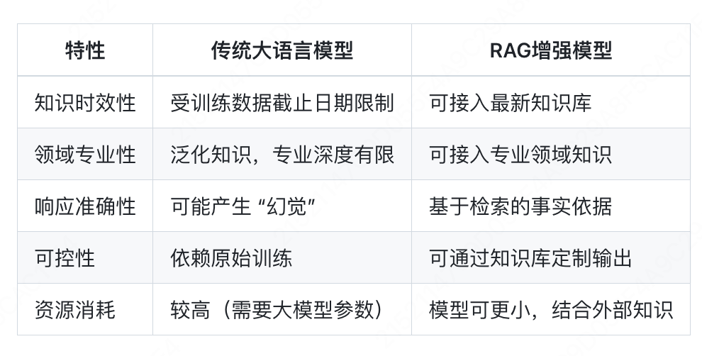

---
# RAG工作流程

RAG技术实现主要包含以下4个核心步骤，让我们分步来学习:
1) 文档收集和切割 
2) 向量转换和存储 
3) 文档过滤和检索 
4) 查询增强和关联
## 1、文档收集和切割
文档收集:从各种来源(网页、PDF、数据库等)收集原始文档

文档预处理:清洗、标准化文本格式

文档切割:将长文档分割成适当大小的片段(俗称chunks)

    基于固定大小(如512个token)

    基于语义边界(如段落、章节)

    基于递归分割策略(如递归字符n-gram切割)

## 2、向量转换和存储

**向量转换**:使用Embedding模型将文本块转换为高维向量表示，可以捕获到文本的语义特征

**向量存储**:将生成的向量和对应文本存入向量数据库，支持高效的相似性搜索

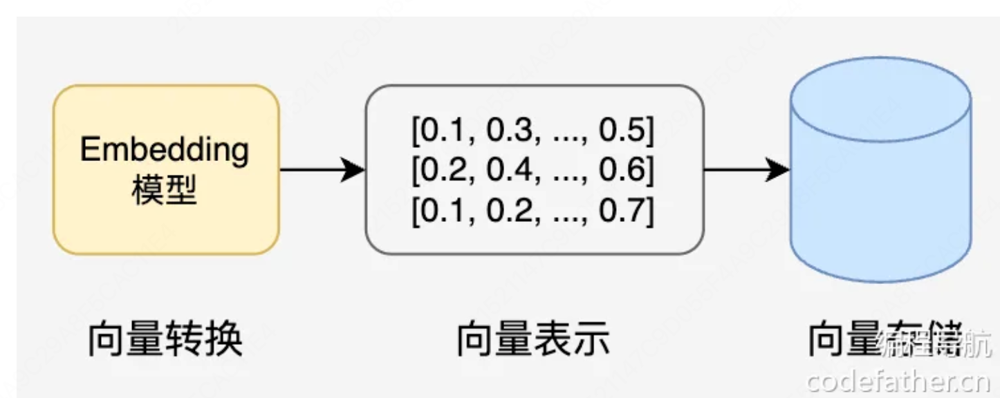

## 3、文档过滤和检索
**查询处理**:将用户问题也转换为向量表示

**过滤机制**:基于元数据、关键词或自定义规则进行过滤

**相似度搜索**:在向量数据库中查找与问题向量最相似的文档块，常用的相似度搜索算法有余弦相似度、欧氏距离等

**上下文组装**:将检索到的多个文档块组装成连贯上下文
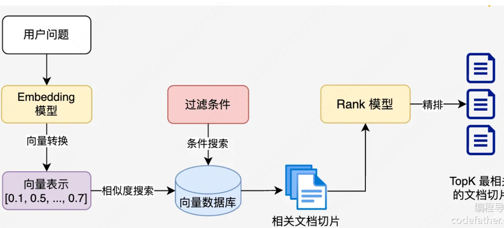

## 4、查询增强和关联

提示词组装:将检索到的相关文档与用户问题组合成增强提示

上下文融合:大模型基于增强提示生成回答

源引用:在回答中添加信息来源引用

后处理:格式化、摘要或其他处理以优化最终输出

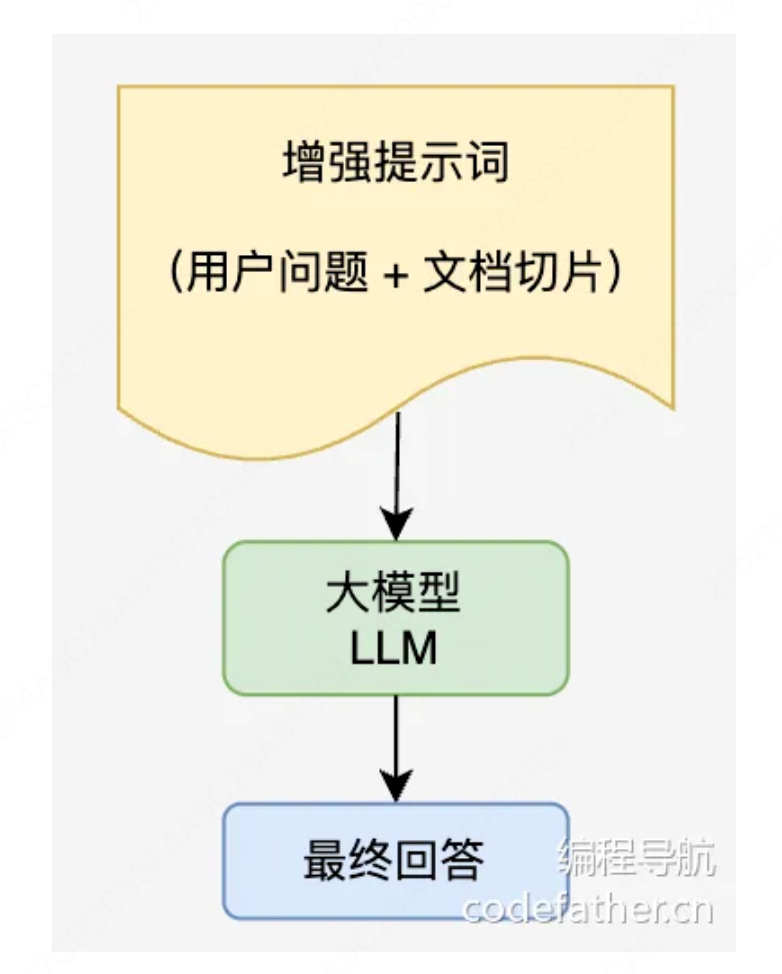

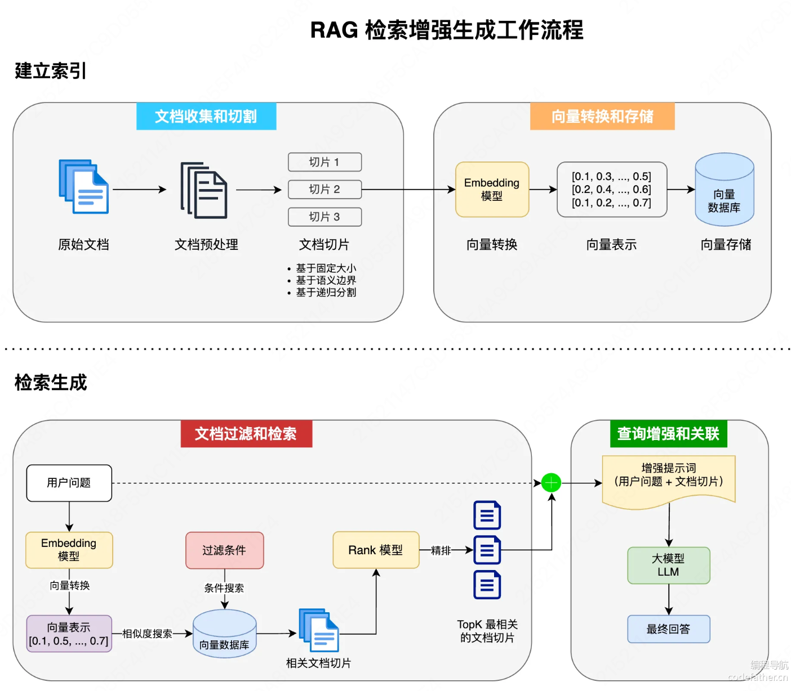


## Embedding和 Embedding 模型
Embedding嵌入是将高维离散数据(如文字、图片)转换为低维连续向量的过程。这些向量能在数学空间中表示原始数据的语义特征，使计算机能够理解数据间的相似性。

Embedding模型是执行这种转换算法的机器学习模型，如Word2Vec(文本)、ResNet(图像)等。不同的Embedding模型产生的向量表示和维度数不同，一般维度越高表达能力更强，可以捕获更丰富的语义信息和更细微的差别，但同样占用更多存储空间。
举个例子，"鱼皮"和"鱼肉"的Embedding向量在空间中较接近，而"鱼皮"和"帅哥"则相距较远，反映了语义关系。

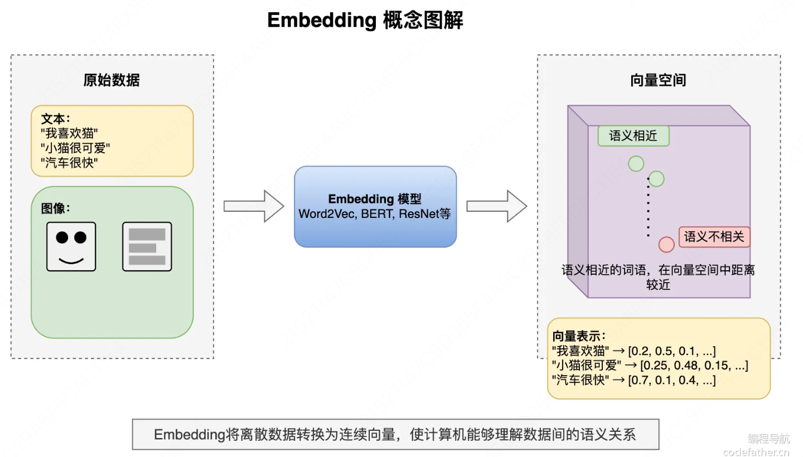

## 向量数据库
向量数据库是专门存储和检索向量数据的数据库系统。

通过高效索引算法实现快速相似性搜索，支持K近邻查询等操作。

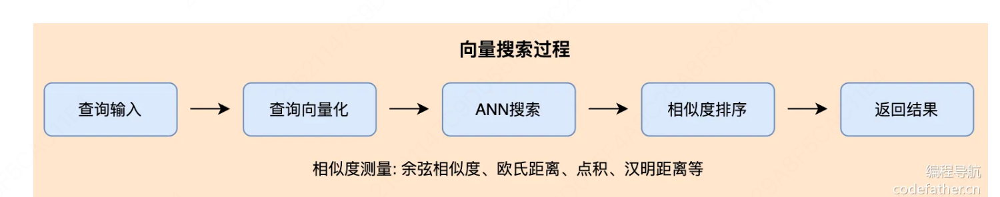

注意，并不是只有向量数据库才能存储向量数据，只不过与传统数据库不同，向量数据库优化了高维向量的存储和检索。
AI的流行带火了一波向量数据库和向量存储，比如Milvus、Pinecone等。此外，一些传统数据库也可以通过安装插件实现向量存储和检索，比如PGVector、Redis Stack的RediSearch等

## 召回
召回是信息检索中的第一阶段，目标是从大规模数据集中快速筛选出可能相关的候选项子集。

强调速度和广度，而非精确度。

举个例子，我们要从搜索引擎查询“编程导航-程序员一站式编程学习交流社区"时，召回阶段会从数十亿网页中快速筛选出数千个含有“编程"、"导航"、“程序员"等相关内容的页面，为后续粗略排序和精细排序提供候选集。

## 精排和Rank模型

**精排**(精确排序)是搜索/推荐系统的最后阶段，使用计算复杂度更高的算法，考虑更多特征和业务规则，对少量候选项进行更复杂、精细的排序。
比如，短视频推荐先通过召回获取数万个可能相关视频，再通过粗排缩减至数百条，最后精排阶段会考虑用户最近的互动、视频热度、内容多样性等复杂因素，确定最终展示的10个视频及顺序。


## 搜索/推荐系统排序流程
1) 用户查询/需求
2) 召回阶段(10,000-100,000条)
3) 粗排阶段(500-1,000条)
4) 候选集数量逐步减少，排序精度逐步提高
5) 精排阶段(50-100条)
6) 最终展示(10-20条)

## Rank模型(排序模型)
负责对召回阶段筛选出的候选集进行精确排序，考虑多种特征评估相关性。
现代Rank模型通常基于深度学习，如BERT、LambdaMART等，综合考虑查询与候选项的相关性、用户历史行为等因素。举个例子，电商推荐系统会根据商品特征、用户偏好、点击率等给每个候选商品打分并排序
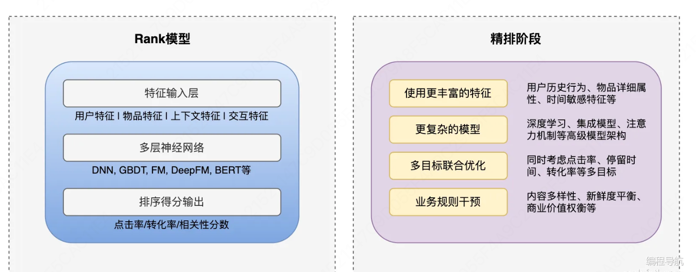

## 混合检索策略

混合检索策略结合多种检索方法的优势，提高搜索效果。常见组合包括关键词检索、语义检索、知识图谱等
比如在AI大模型开发平台Dify中，就为用户提供了"基于全文检索的关键词搜索+基于向量检索的语义检索"的混合检索策略，用户还可以自己设置不同检索方式的权重。

# 文档收集和切割-ETL

文档收集和切割阶段，我们要对自己准备好的知识库文档进行处理，然后保存到向量数据库中。

这个过程俗称ETL(抽取、转换、加载)，SpringAI提供了对ETL的支持，参考[官方文档](https://docs.spring.io/spring-ai/reference/api/etl-pipeline.html)。

## 文档
什么是SpringAI中的文档呢?
文档不仅仅包含文本，还可以包含一系列元信息和多媒体附件:

## ETL
在SpringAI中，对 Document 的处理通常遵循以下流程:
1. 读取文档:使用DocumentReader组件从数据源(如本地文件、网络资源、数据库等)加载文档。
2. 转换文档:根据需求将文档转换为适合后续处理的格式，比如去除冗余信息、分词、词性标注等，可以使用DocumentTransformer 组件实现。 
3. 写入文档:使用DocumentWriter将文档以特定格式保存到存储中，比如将文档以嵌入向量的形式写入到向量数据库，或者以键值对字符串的形式保存到Redis等KV存储中。

流程如图:

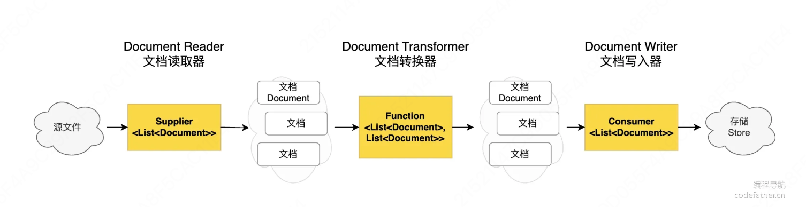

我们利用 Spring AI实现 ETL,核心就是要学习**DocumentReader、DocumentTransformer、DocumentWriter** 三大组件。

## 抽取(Extract)

SpringAI通过DocumentReader组件实现文档抽取，也就是把文档加载到内存中。
看下源码，DocumentReader接口实现了 Supplier<List<Document>>接口，主要负责从各种数据源读取数据并转换为Document 对象集合。

```java
public interface DocumentReader extends Supplier<List<Document>> {
    default List<Document> read() {
        return get();
    }
}

```

实际开发中，我们可以直接使用Spring AI内置的多种[DocumentReader 实现类](https://docs.spring.io/spring-ai/reference/api/etl-pipeline.html#_documentreaders)，用于处理不同类型的数据源:
1. JsonReader:读取JSON文档 
2. TextReader:读取纯文本文件
3. MarkdownReader: 读取 Markdown 文件 
4. PDFReader:读取 PDF文档，基于Apache PdfBox库实现 
      PagePdfDocumentReader:按照分页读取PDF 
      ParagraphPdfDocumentReader:按照段落读取 PDF
5. HtmlReader:读取HTML文档，基于jsoup库实现 
6. TikaDocumentReader:基于[Apache Tika库](https://tika.apache.org/3.1.0/formats.html)处理多种格式的文档，更灵活
   
以JsonReader 为例，支持JSON Pointers特性，能够快速指定从JSON文档中提取哪些字段和内容:

```java
// 从 classpath 下的 JSON 文件中读取文档
 @Component
 class MyJsonReader {
     private final Resource resource;

     MyJsonReader(@Value("classpath:products.json") Resource resource) {
         this.resource = resource;
     }

     // 基本用法
     List<Document> loadBasicJsonDocuments() {
         JsonReader jsonReader = new JsonReader(this.resource);
         return jsonReader.get();
     }

     // 指定使用哪些 JSON 字段作为文档内容
     List<Document> loadJsonWithSpecificFields() {
         JsonReader jsonReader = new JsonReader(this.resource, "description", "features");
         return jsonReader.get();
     }

     // 使用 JSON 指针精确提取文档内容
     List<Document> loadJsonWithPointer() {
         JsonReader jsonReader = new JsonReader(this.resource);
         return jsonReader.get("/items"); // 提取 items 数组内的内容
     }
 }
```

更多的文档读取器等用到的时候再了解用法即可。

此外，SpringAIAlibaba官方社区提供了更多的文档读取器，比如加载飞书文档、提取B站视频信息和字幕、加载邮件、加载GitHub官方文档、加载数据库等等。

思考:如果让你自己实现一个DocumentReader组件，你会怎么实现呢?当然是先看[官方开源的代码仓库](https://github.com/alibaba/spring-ai-alibaba/tree/main/community/document-readers)，看看大佬们是怎么实现的:

### 邮件解析

```java
public class MsgEmailParser {

    private MsgEmailParser() {
        // Private constructor to prevent instantiation
    }

    /**
     * Convert MsgEmailElement to Document
     * @param element MSG email element
     * @return Document object
     */
    public static Document convertToDocument(MsgEmailElement element) {
        if (element == null) {
            throw new IllegalArgumentException("MsgEmailElement cannot be null");
        }

        // Build metadata
        Map<String, Object> metadata = new HashMap<>();

        // Add metadata with null check
        if (StringUtils.hasText(element.getSubject())) {
            metadata.put("subject", element.getSubject());
        }
    
    // ... 省略更多元信息的设置

        // Create Document object with content null check
        String content = StringUtils.hasText(element.getText()) ? element.getText() : "";
        return new Document(content, metadata);
    }

}

```

## 转换 (Transform)
Spring AI通过 DocumentTransformer 组件实现文档转换。

看下源码，DocumentTransformer 接口实现了 Function<List<Document>,List<Document>>接口，负责将一组文档转换为另一组文档。

```java
public interface DocumentTransformer extends Function<List<Document>, List<Document>> {
    default List<Document> transform(List<Document> documents) {
        return apply(documents);
    }
}

```

文档转换是保证RAG效果的核心步骤，也就是如何将大文档合理拆分为便于检索的知识碎片，SpringAI提供了多种 DocumentTransformer实现类，可以简单分为3类。
1) TextSplitter 文本分割器

其中TextSplitter是文本分割器的基类，提供了分割单词的流程方法:

TokenTextSplitter是其实现类，基于Token的文本分割器。它考虑了语义边界(比如句子结尾)来创建有意义的文本段落，是成本较低的文本切分方式。

```java
@Component
class MyTokenTextSplitter {

    public List<Document> splitDocuments(List<Document> documents) {
        TokenTextSplitter splitter = new TokenTextSplitter();
        return splitter.apply(documents);
    }

    public List<Document> splitCustomized(List<Document> documents) {
        TokenTextSplitter splitter = new TokenTextSplitter(1000, 400, 10, 5000, true);
        return splitter.apply(documents);
    }
}

```
TokenTextSplitter 提供了两种构造函数选项:

   1、 TokenTextSplitter():使用默认设置创建分割器。

   2、 TokenTextsplitter(int defaultChunkSize, int minchunkSizeChars, int minchunkLengthToEmbed, intmaxNumchunks，booleankeepSeparator):使用自定义参数创建分割器，通过调整参数，可以控制分割的粒度和方式，适应不同的应用场景。
   
   参数说明(无需记忆):

   ·defaultChunkSize:每个文本块的目标大小(以token为单位，默认值:800)。
   
   ·minChunkSizeChars:每个文本块的最小大小(以字符为单位，默认值:350)。

   ·minChunkLengthToEmbed:要被包含的块的最小长度(默认值:5)。

   ·maxNumChunks:从文本中生成的最大块数(默认值:10000)。

   ·keepSeparator:是否在块中保留分隔符(如换行符)(默认值:true)。
   
官方文档有对Token分词器工作原理的详细解释，可以简单了解下:

1.使用CL100K_BASE编码将输入文本编码为token。
   
2.根据 defaultChunkSize将编码后的文本分割成块。

3.对于每个块:

将块解码回文本。
   
尝试在minChunkSizeChars之后找到合适的断点(句号、问号、感叹号或换行符)。

如果找到断点，则在该点截断块。 

修剪块并根据keepSeparator 设置选择性地删除换行符。 

如果生成的块长度大于minChunkLengthToEmbed，则将其添加到输出中。

这个过程会一直持续到所有token都被处理完或达到maxNumChunks为止。 

如果剩余文本长度大于minChunkLengthToEmbed，则会作为最后一个块添加。

---

2) MetadataEnricher 元数据增强器

元数据增强器的作用是为文档补充更多的元信息，便于后续检索，而不是改变文档本身的切分规则。包括:

·KeywordMetadataEnricher:使用AI 提取关键词并添加到元数据

·SummaryMetadataEnricher:使用AI生成文档摘要并添加到元数据。不仅可以为当前文档生成摘要，还能关联前一个和后一个相邻的文档，让摘要更完整。

```java
@Component
class MyDocumentEnricher {

    private final ChatModel chatModel;

    MyDocumentEnricher(ChatModel chatModel) {
        this.chatModel = chatModel;
    }
      
      // 关键词元信息增强器
    List<Document> enrichDocumentsByKeyword(List<Document> documents) {
        KeywordMetadataEnricher enricher = new KeywordMetadataEnricher(this.chatModel, 5);
        return enricher.apply(documents);
    }
  
    // 摘要元信息增强器
    List<Document> enrichDocumentsBySummary(List<Document> documents) {
        SummaryMetadataEnricher enricher = new SummaryMetadataEnricher(chatModel, 
            List.of(SummaryType.PREVIOUS, SummaryType.CURRENT, SummaryType.NEXT));
        return enricher.apply(documents);
    }
}

```
3) ContentFormatter 内容格式化工具用于统一文档内容格式。官方对这个的介绍少的可怜，感觉像是个孤儿功能。。。我们不妨看它的实现类 DefaultContentFormatter 的源码来了解他的功能:

主要提供了3类功能:

1. 文档格式化:将文档内容与元数据合并成特定格式的字符串，以便于后续处理。
2. 元数据过滤:根据不同的元数据模式(MetadataMode)筛选需要保留的元数据项:

   ALL:保留所有元数据

   NONE:移除所有元数据
   
   INFERENCE:用于推理场景，排除指定的推理元数据
   
   EMBED:用于嵌入场景，排除指定的嵌入元数据

3. 自定义模板:支持自定义以下格式:

元数据模板:控制每个元数据项的展示方式

元数据分隔符:控制多个元数据项之间的分隔方式

文本模板:控制元数据和内容如何结合

该类采用Builder模式创建实例，使用示例:

```java
DefaultContentFormatter formatter = DefaultContentFormatter.builder()
    .withMetadataTemplate("{key}: {value}")
    .withMetadataSeparator("\n")
    .withTextTemplate("{metadata_string}\n\n{content}")
    .withExcludedInferenceMetadataKeys("embedding", "vector_id")
    .withExcludedEmbedMetadataKeys("source_url", "timestamp")
    .build();

// 使用格式化器处理文档
String formattedText = formatter.format(document, MetadataMode.INFERENCE);

```

在RAG系统中，这个格式化器可以有下面的作用，了解即可:

1.提供上下文:将元数据(如文档来源、时间、标签等)与内容结合，丰富大语言模型的上下文信息

2.过滤无关信息:通过排除特定元数据，减少，提高检索和生成质量

3.场景适配:为不同场景(如推理和嵌入)提供不同的格式化策略

4.结构化输出:为AI模型提供结构化的输入，使其能更好地理解和处理文档内容

## 加载(Load)

SpringAI通过DocumentWriter组件实现文档加载(写入)。

DocumentWriter接口实现了Consumer<List<Document>>接口，负责将处理后的文档写入到目标存储中:

```java
public interface DocumentWriter extends Consumer<List<Document>> {
    default void write(List<Document> documents) {
        accept(documents);
    }
}

```

Spring Al提供了2种内置的DocumentWriter 实现:
1) FileDocumentWriter:将文档写入到文件系统1)

```java
@Component
class MyDocumentWriter {
    public void writeDocuments(List<Document> documents) {
        FileDocumentWriter writer = new FileDocumentWriter("output.txt", true, MetadataMode.ALL, false);
        writer.accept(documents);
    }
}

```

2) VectorStoreWriter:将文档写入到向量数据库
```java
@Component
class MyVectorStoreWriter {
    private final VectorStore vectorStore;
    
    MyVectorStoreWriter(VectorStore vectorStore) {
        this.vectorStore = vectorStore;
    }
    
    public void storeDocuments(List<Document> documents) {
        vectorStore.accept(documents);
    }
}

```
当然，你也可以同时将文档写入多个存储，只需要创建多个Writer或者自定义Writer即可。

## ETL 流程示例
将上述3大组件组合起来，可以实现完整的ETL流程:

````java
// 抽取：从 PDF 文件读取文档
PDFReader pdfReader = new PagePdfDocumentReader("knowledge_base.pdf");
List<Document> documents = pdfReader.read();

// 转换：分割文本并添加摘要
TokenTextSplitter splitter = new TokenTextSplitter(500, 50);
List<Document> splitDocuments = splitter.apply(documents);

SummaryMetadataEnricher enricher = new SummaryMetadataEnricher(chatModel, 
    List.of(SummaryType.CURRENT));
List<Document> enrichedDocuments = enricher.apply(splitDocuments);

// 加载：写入向量数据库
vectorStore.write(enrichedDocuments);

// 或者使用链式调用
vectorStore.write(enricher.apply(splitter.apply(pdfReader.read())));

````

通过这种方式，我们完成了从原始文档到向量数据库的整个ETL过程，为后续的检索增强生成提供了基础。

## 向量转换和存储
上一节教程中有介绍过，向量存储是RAG应用中的核心组件，它将文档转换为向量(嵌入)并存储起来，以便后续进行高效的相似性搜索。Spring AI官方提供了向量数据库接口Vectorstore 和向量存储整合包，帮助开发者快速集成各种第三方向量存储，比如Milvus、Redis、PGVector、Elasticsearch等。

## VectorStore 接口介绍
VectorStore是Spring AI中用于与向量数据库交互的核心接口，它继承自DocumentWriter，主要提供以下功能:
```java
public interface VectorStore extends DocumentWriter {

    default String getName() {
        return this.getClass().getSimpleName();
    }

    void add(List<Document> documents);

    void delete(List<String> idList);

    void delete(Filter.Expression filterExpression);

    default void delete(String filterExpression) { ... };

    List<Document> similaritySearch(String query);

    List<Document> similaritySearch(SearchRequest request);

    default <T> Optional<T> getNativeClient() {
        return Optional.empty();
    }
}

```

这个接口定义了向量存储的基本操作，简单来说就是"增删改查":

添加文档到向量库

从向量库删除文档

基于查询进行相似度搜索

获取原生客户端(用于特定实现的高级操作)

## 搜索请求构建
Spring AI提供了SearchRequest类，用于构建相似度搜索请求:
```java
SearchRequest request = SearchRequest.builder()
    .query("什么是程序员鱼皮的编程导航学习网 codefather.cn？")
    .topK(5)                  // 返回最相似的5个结果
    .similarityThreshold(0.7) // 相似度阈值，0.0-1.0之间
    .filterExpression("category == 'web' AND date > '2025-05-03'")  // 过滤表达式
    .build();

List<Document> results = vectorStore.similaritySearch(request);

```
SearchRequest提供了多种配置选项:

query:搜索的查询文本

topK:返回的最大结果数，默认为4

similarityThreshold:相似度阈值，低于此值的结果会被过滤掉

filterExpression:基于文档元数据的过滤表达式，语法有点类似 SQL语句，需要用到时查询[官方文档](https://docs.spring.io/spring-ai/reference/api/vectordbs.html#metadata-filters)了解语法即可

## 向量存储的工作原理
在向量数据库中，查询与传统关系型数据库有所不同。向量库执行的是相似性搜索，而非精确匹配，具体流程我们在上一节教程中有了解，可以再复习下。

1.嵌入转换:当文档被添加到向量存储时，Spring AI会使用嵌入模型(如OpenAI的text-embedding-ada-002)将文本转换为向量。

2.相似度计算:查询时，查询文本同样被转换为向量，然后系统计算此向量与存储中所有向量的相似度。

3.相似度度量:常用的相似度计算方法包括:
   ·余弦相似度:计算两个向量的夹角余弦值，范围在-1到1之间
   ·欧氏距离:计算两个向量间的直线距离
   ·点积:两个向量的点积值

4.过滤与排序:根据相似度阈值过滤结果，并按相似度排序返回最相关的文档支持的向量数据库

SpringAI支持多种向量数据库实现，包括:
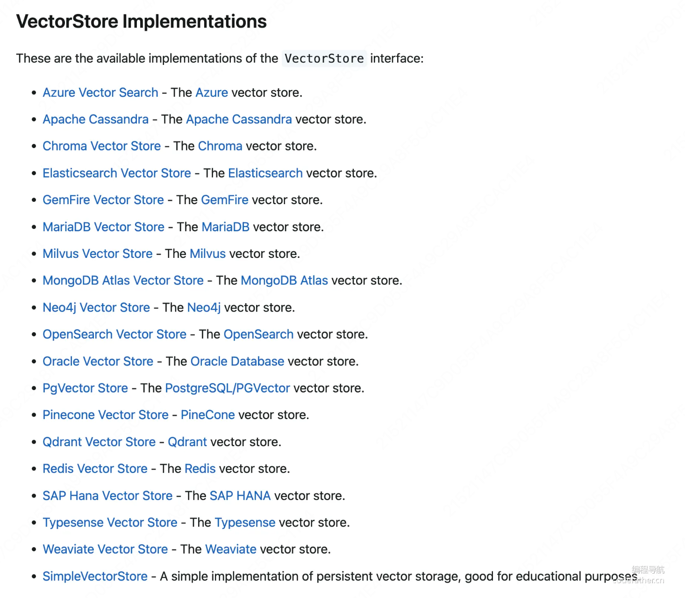

对于每种Vector Store实现，我们都可以参考对应的官方文档进行整合.

开发方法基本上一致:先准备好数据源=>引入不同的整合包=>编写对应的配置=>使用自动注入的VectorStore即可。

值得一提的是，SpringAI Alibaba已经集成了阿里云百炼平台，可以直接使用阿里云百炼平台提供的 VectorStoreAPI，无需自己再搭建向量数据库了。
参考[官方文档](https://java2ai.com/docs/1.0.0-M6.1/tutorials/vectorstore/)，主要是提供了DashScopeCloudStore类:

## 基于PGVector 实现向量存储
PGVector 是经典数据库PostgreSQL的扩展，为PostgreSQL提供了存储和检索高维向量数据的能力。

为什么选择它来实现向量存储呢?因为很多传统业务都会把数据存储在这种关系型数据库中，直接给原有的数据库安装扩展就能实现向量相似度搜索、而不需要额外搞一套向量数据库，人力物力成本都很低，所以这种方案很受企业青睐，也是目前实现RAG的主流方案之一。

首先我们准备PostgreSQL数据库，并为其添加扩展。有2种方式，第一种是在自己的本地或服务器安装，可以参考下列文章实现:
[Linux服务器快速安装PostgreSQL15与pgvector向量插件实践](https://cloud.baidu.com/article/3229759)
[宝塔PostgreSQL安装 pgvector 插件实现向量存储](https://blog.csdn.net/qq_29213799/article/details/146277755)
这里由于大家更多的是为了学习，我们采用更方便的方式--使用现成的云数据库，下面我们来实操下~

1)首先打开阿里云[PostgreSQL官网](https://www.aliyun.com/product/rds/postgresql)，开通Serverless版本，按用量计费，对于学习来说性价比更高:

开通serverless数据库服务,填写配置

开通成功后进入控制台,创建账号

创建数据库

进入插件管理,安装vector插件

进入数据库连接,开通公网访问地址

可以在本地使用idea自带数据库管理工具,进行连接测试


参考[springai官方文档](https://docs.spring.io/spring-ai/reference/api/vectordbs/pgvector.html),整合pgvector

```java
<dependency>
    <groupId>org.springframework.ai</groupId>
    <artifactId>spring-ai-starter-vector-store-pgvector</artifactId>
    <version>1.0.0-M7</version>
</dependency>

```

编写配置
```java
spring:
  datasource:
    url: jdbc:postgresql://改为你的公网地址/yu_ai_agent
    username: 改为你的用户名
    password: 改为你的密码
  ai:
    vectorstore:
      pgvector:
        index-type: HNSW
        dimensions: 1536
        distance-type: COSINE_DISTANCE
        max-document-batch-size: 10000 # Optional: Maximum number of documents per batch

```

注意，在不确定向量维度的情况下，定不要指定 dimensions 配置!否则很可能会报错!

如果未明确指定，PgVectorStore将从提供的EmbeddingModel 中检索维度，维度在表创建时设置为嵌入列。如果更改维度，则必须重新创建Vectortore表。不过最好提前明确你要使用的嵌入维度值，手动建表，更可靠一些。

正常情况下，接下来就可以使用自动注。入的VectorStore了，系统会自动创建库表:
```java
@Autowired
VectorStore vectorStore;

// ...

List<Document> documents = List.of(
    new Document("Spring AI rocks!! Spring AI rocks!! Spring AI rocks!! Spring AI rocks!! Spring AI rocks!!", Map.of("meta1", "meta1")),
    new Document("The World is Big and Salvation Lurks Around the Corner"),
    new Document("You walk forward facing the past and you turn back toward the future.", Map.of("meta2", "meta2")));

// Add the documents to PGVector
vectorStore.add(documents);

// Retrieve documents similar to a query
List<Document> results = this.vectorStore.similaritySearch(SearchRequest.builder().query("Spring").topK(5).build());
```

但是，这种方式不适合我们现在的项目!因为VectorStore依赖EmbeddingModel对象，咱们之前的学习中同时引入了Ollama和阿里云 Dashscope的依赖，有两个EmbeddingModel 的Bean，Spring不知道注入哪个，就会报下面这种错误:

所以让我们换一种更灵活的方式来初始化 VectorStore。先引|入3个依赖:

```java
<dependency>
    <groupId>org.springframework.boot</groupId>
    <artifactId>spring-boot-starter-jdbc</artifactId>
</dependency>
<dependency>
    <groupId>org.postgresql</groupId>
    <artifactId>postgresql</artifactId>
    <scope>runtime</scope>
</dependency>
<dependency>
    <groupId>org.springframework.ai</groupId>
    <artifactId>spring-ai-pgvector-store</artifactId>
    <version>1.0.0-M6</version>
</dependency>
```
然后编写配置类自己构造 PgVectorStore，不用Starter自动注入:
```java
@Configuration
public class PgVectorVectorStoreConfig {

    @Bean
    public VectorStore pgVectorVectorStore(JdbcTemplate jdbcTemplate, EmbeddingModel dashscopeEmbeddingModel) {
        VectorStore vectorStore = PgVectorStore.builder(jdbcTemplate, dashscopeEmbeddingModel)
                .dimensions(1536)                    // 不要盲目设置
                .distanceType(COSINE_DISTANCE)       // Optional: defaults to COSINE_DISTANCE
                .indexType(HNSW)                     // Optional: defaults to HNSW
                .initializeSchema(true)              // Optional: defaults to false
                .schemaName("public")                // Optional: defaults to "public"
                .vectorTableName("vector_store")     // Optional: defaults to "vector_store"
                .maxDocumentBatchSize(10000)         // Optional: defaults to 10000
                .build();
        return vectorStore;
    }
}
```

注意，在不确定向量维度的情况下，一定不要指定 dimensions配置!否则很可能会报错!如果你想使用特定的Embedding模型，必须到模型官网查看文档来了解模型支持的向量维度。

并且启动类要排除掉自动加载，否则也会报错:

```java
@SpringBootApplication(exclude = PgVectorStoreAutoConfiguration.class)
public class YuAiAgentApplication {

    public static void main(String[] args) {
        SpringApplication.run(YuAiAgentApplication.class, args);
    }

}

```
编写测试类
```java
@SpringBootTest
public class PgVectorVectorStoreConfigTest {

    @Resource
    VectorStore pgVectorVectorStore;

    @Test
    void test() {
        List<Document> documents = List.of(
                new Document("Spring AI rocks!! Spring AI rocks!! Spring AI rocks!! Spring AI rocks!! Spring AI rocks!!", Map.of("meta1", "meta1")),
                new Document("The World is Big and Salvation Lurks Around the Corner"),
                new Document("You walk forward facing the past and you turn back toward the future.", Map.of("meta2", "meta2")));
        // 添加文档
        pgVectorVectorStore.add(documents);
        // 相似度查询
        List<Document> results = pgVectorVectorStore.similaritySearch(SearchRequest.builder().query("Spring").topK(5).build());
        Assertions.assertNotNull(results);
    }
}

```

替换原来的本地vectorstory
```java
@Configuration
public class PgVectorVectorStoreConfig {

    @Resource
    private LoveAppDocumentLoader loveAppDocumentLoader;

    @Bean
    public VectorStore pgVectorVectorStore(JdbcTemplate jdbcTemplate, EmbeddingModel dashscopeEmbeddingModel) {
        VectorStore vectorStore = PgVectorStore.builder(jdbcTemplate, dashscopeEmbeddingModel)
                .dimensions(1536)                    // Optional: defaults to model dimensions or 1536
                .distanceType(COSINE_DISTANCE)       // Optional: defaults to COSINE_DISTANCE
                .indexType(HNSW)                     // Optional: defaults to HNSW
                .initializeSchema(true)              // Optional: defaults to false
                .schemaName("public")                // Optional: defaults to "public"
                .vectorTableName("vector_store")     // Optional: defaults to "vector_store"
                .maxDocumentBatchSize(10000)         // Optional: defaults to 10000
                .build();
        // 加载文档
        List<Document> documents = loveAppDocumentLoader.loadMarkdowns();
        vectorStore.add(documents);
        return vectorStore;
    }
}

```

注意，有些Embedding模型可能有加载文档的单批数量限制，这时你可以通过for循环分为多批插入。
```java
@Bean
public VectorStore pgVectorVectorStore(JdbcTemplate jdbcTemplate, EmbeddingModel dashscopeEmbeddingModel) {
    ...
    // 加载文档，分批添加（DashScope Embedding API 限制单次 batch size 不超过 10）
    List<Document> documents = loveAppDocumentLoader.loadMarkdowns();
    int batchSize = 10;
    for (int i = 0; i < documents.size(); i += batchSize) {
        int end = Math.min(i + batchSize, documents.size());
        vectorStore.add(documents.subList(i, end));
    }
    return vectorStore;
}
```

### 扩展知识-批处理策略

在使用向量存储时，可能要嵌入大量文档，如果一次性处理存储大量文档，可能会导致性能问题、甚至出现错误导致数据不完整。

举个例子，嵌入模型一般有一个最大标记限制，通常称为上下文窗口大小(context window size)，限制了单个嵌入请求中可以处理的文本量。如果在一次调用中转换过多文档可能直接导致报错。

为此，Spring AI实现了批处理策略(Batching Strategy)，将大量文档分解为较小的批次，使其适合嵌入模型的最大上下文窗口，还可以提高性能并更有效地利用API速率限制。
Spring AI通过 BatchingStrategy接口提供该功能，该接口允许基于文档的标记计数并以分批方式处理文档:
```java
public interface BatchingStrategy {
    List<List<Document>> batch(List<Document> documents);
}
```

该接口定义了一个单一方法 batch，它接收一个文档列表并返回一个文档批次列表。

Spring AI提供了一个名为TokenCountBatchingStrategy 的默认实现。这个策略为每个文档估算token数，将文档分组到不超过最大输入token数的批次中，如果单个文档超过此限制，则抛出异常。这样就确保了每个批次不超过计算出的最大输入token数。
可以自定义TokenCountBatchingStrategy

示例代码:
```java
@Configuration
public class EmbeddingConfig {
    @Bean
    public BatchingStrategy customTokenCountBatchingStrategy() {
        return new TokenCountBatchingStrategy(
            EncodingType.CL100K_BASE,  // 指定编码类型
            8000,                      // 设置最大输入标记计数
            0.1                        // 设置保留百分比
        );
    }
}
```
或者自己是实现BatchingStrategy

```java
@Configuration
public class EmbeddingConfig {
    @Bean
    public BatchingStrategy customBatchingStrategy() {
        return new CustomBatchingStrategy();
    }
}

```

## 文档过滤和检索
SpringAI官方声称提供了一个"模块化"的RAG架构，用于优化大模型回复的准确性。

简单来说，就是把整个文档过滤检索阶段拆分为:检索前、检索时、检索后，分别针对每个阶段提供了可自定义的组件。

在预检索阶段，系统接收用户的原始查询，通过查询转换和查询扩展等方法对其进行优化，输出增强的用户查询。

在检索阶段，系统使用增强的查询从知识库中搜索相关文档，可能涉及多个检索源的合并，最终输出一组相关文档。

在检索后阶段，系统对检索到的文档进行进一步处理，包括排序、选择最相关的子集以及压缩文档内容，输出经过优化的相关文档集。

预检索:优化用户查询

预检索阶段负责处理和优化用户的原始查询，以提高后续检索的质量。SpringAI提供了多种查询处理组件。

## 查询转换-查询重写

RewritequeryTransformer使用大语言模型对用户的原始查询进行改写，使其更加清晰和详细。当用户查询含糊不清或包含无关信息时，这种方法特别有用。

```java
Query query = new Query("啥是程序员鱼皮啊啊啊啊？");

QueryTransformer queryTransformer = RewriteQueryTransformer.builder()
        .chatClientBuilder(chatClientBuilder)
        .build();

Query transformedQuery = queryTransformer.transform(query);
```

## 查询转换-查询翻译

TranslationQueryTransfornmer 将查询翻译成嵌入模型支持的目标语言。如果查询已经是目标语言，则保持不变。这对于嵌入模型是针对特定语言训练而用户查询使用不同语言的情况非常有用，便于实现国际化应用。

示例代码如下:
```java
Query query = new Query("hi, who is coder yupi? please answer me");

QueryTransformer queryTransformer = TranslationQueryTransformer.builder()
        .chatClientBuilder(chatClientBuilder)
        .targetLanguage("chinese")
        .build();

Query transformedQuery = queryTransformer.transform(query);

```
语言可以随便指定，因为看源码我们会发现，查询翻译器也是通过给AI一段Prompt来实现翻译，当然也可以自定义翻译的Prompt:

不过鱼皮不太建议使用这个查询器，因为调用AI的成本远比调用第三方翻译APl的成本要高，不如自己有样学样定义一个QueryTransformer。

## 查询转换-查询压缩

compressionqueryTransformer使用大语言模型将对话历史和后续查询压缩成一个独立的查询，类似于概括总结。适用于对话历史较长且后续查询与对话上下文相关的场景。

示例代码如下:
```java
Query query = Query.builder()
        .text("编程导航有啥内容？")
        .history(new UserMessage("谁是程序员鱼皮？"),
                new AssistantMessage("编程导航的创始人 codefather.cn"))
        .build();

QueryTransformer queryTransformer = CompressionQueryTransformer.builder()
        .chatClientBuilder(chatClientBuilder)
        .build();

Query transformedQuery = queryTransformer.transform(query);
```

## 查询扩展-多查询扩展

MultiqueryExpander使用大语言模型将一个查询扩展为多个语义上不同的变体，有助于检索额外的上下文信息并增加找到相关结果的机会。就理解为我们在网上搜东西的时候，可能一种关键词搜不到，就会尝试一些不同的关键词。

示例代码如下:
```java
MultiQueryExpander queryExpander = MultiQueryExpander.builder()
    .chatClientBuilder(chatClientBuilder)
    .numberOfQueries(3)
    .build();
List<Query> queries = queryExpander.expand(new Query("啥是程序员鱼皮？他会啥？"));
```

上面这个查询可能被扩展为:

请介绍程序员鱼皮，以及他的专业技能

给出程序员鱼皮的个人简介，以及他的技能

程序员鱼皮有什么专业技能，并给出更多介绍

默认情况下，会在扩展查询列表中包含原始查询。可以在构造时通过 includeoriginal方法改变这个行为:

```java
MultiQueryExpander queryExpander = MultiQueryExpander.builder()
    .chatClientBuilder(chatClientBuilder)
    .includeOriginal(false)
    .build();

```

## 检索:提高查询相关性

检索模块负责从存储中查询检索出最相关的文档。

### 文档搜索
之前我们有了解过DocumentRetriever 的概念，这是Spring AI提供的文档检索器。每种不同的存储方案都可能有自己的文档检索器实现类，比如 VectorstoreDocumentRetriever，从向量存储中检索与输入查询语义相似的文档。它支持基于元数据的过滤、设置相似度阈值、设置返回的结果数。

```java
DocumentRetriever retriever = VectorStoreDocumentRetriever.builder()
    .vectorStore(vectorStore)
    .similarityThreshold(0.7)
    .topK(5)
    .filterExpression(new FilterExpressionBuilder()
        .eq("type", "web")
        .build())
    .build();
List<Document> documents = retriever.retrieve(new Query("谁是程序员鱼皮"));

```
上述代码中的filterExpression 可以灵活地指定过滤条件。当然也可以通过构造Query 对象的FILTER_EXPRESSION参数动态指定过滤表达式

```java
Query query = Query.builder()
    .text("谁是鱼皮？")
    .context(Map.of(VectorStoreDocumentRetriever.FILTER_EXPRESSION, "type == 'boy'"))
    .build();
List<Document> retrievedDocuments = documentRetriever.retrieve(query);

```

### 文档合并

Spring AI内置了ConcatenationDocumentJoiner 文档合并器，通过连接操作，将基于多个查询和来自多个数据源检索到的文档合并成单个文档集合。在遇到重复文档时，会保留首次出现的文档，每个文档的分数保持不变。

示例代码如下:
```java
Map<Query, List<List<Document>>> documentsForQuery = ...
DocumentJoiner documentJoiner = new ConcatenationDocumentJoiner();
List<Document> documents = documentJoiner.join(documentsForQuery);

```
看源码发现，这玩意的实现原理很简单，说是“连接"，其实就是把Map展开为二维列表、再把二维列表展开成文档列表，最后进行去重。但不得不说，这段StreamAPI的使用真是优雅~

## 检索后:优化文档处理

检索后模块负责处理检索到的文档，以实现最佳生成结果。它们可以解决“丢失在中间"问题、模型上下文长度限制，以及减少检索信息中的噪音和冗余。
这些模块可能包括:

根据与查询的相关性对文档进行排序

删除不相关或冗余的文档

压缩每个文档的内容以减少噪音和冗余

不过这个模块官方文档的讲解非常少，而且更新很快，比如鱼皮在写本节教程时，已经从M7更新到了M8，引入了新的DocumentPostProcessor API来代替原来的实现。

这一部分也不是我们实际开发中要优化的重点，感兴趣的同学可以自行研究。

查询增强和关联生成阶段是RAG流程的最终环节，负责将检索到的文档与用户查询结合起来，为AI提供必要的上下文，从而生成更准确、更相关的回答。
之前我们已经了解了SpringAI提供的2种实现RAG查询增强的Advisor，分别是 QuestionAnswerAdvisor 和RetrievalAugmentationAdvisor.

## QuestionAnswerAdvisor 查询增强

当用户问题发送到AI模型时，Advisor会查询向量数据库来获取与用户问题相关的文档，并将这些文档作为上下文附加到用户查询中。

基本使用方式如下:

```java
ChatResponse response = ChatClient.builder(chatModel)
        .build().prompt()
        .advisors(new QuestionAnswerAdvisor(vectorStore))
        .user(userText)
        .call()
        .chatResponse();

```
我们可以通过建造者模式配置更精细的参数，比如文档过滤条件

```java
var qaAdvisor = QuestionAnswerAdvisor.builder(vectorStore)
              // 相似度阈值为 0.8，并返回最相关的前 6 个结果
        .searchRequest(SearchRequest.builder().similarityThreshold(0.8d).topK(6).build())
        .build();

```

此外,QuestionAnswerAdvisor 还支持动态过滤表达式，可以在运行时根据需要调整过滤条件:
```java
ChatClient chatClient = ChatClient.builder(chatModel)
    .defaultAdvisors(QuestionAnswerAdvisor.builder(vectorStore)
        .searchRequest(SearchRequest.builder().build())
        .build())
    .build();

// 在运行时更新过滤表达式
String content = this.chatClient.prompt()
    .user("看着我的眼睛，回答我！")
    .advisors(a -> a.param(QuestionAnswerAdvisor.FILTER_EXPRESSION, "type == 'web'"))
    .call()
    .content();

```
QuestionAnswerAdvisor的实现原理很简单，把用户提示词和检索到的文档等上下文信息拼成一个新的Promp t，再调用Al:

当然，我们也可以自定义提示词模板，控制如何将检索到的文档与用户查询结合:
```java
QuestionAnswerAdvisor qaAdvisor = QuestionAnswerAdvisor.builder(vectorStore)
    .promptTemplate(customPromptTemplate)
    .build();

```
RetrievalAugmentationAdvisor 查询增强SpringAI提供的另一种RAG实现方式，它基于RAG模块化架构，提供了更多的灵活性和定制选项。最简单的RAG流程可以通过以下方式实现:

```java
Advisor retrievalAugmentationAdvisor = RetrievalAugmentationAdvisor.builder()
        .documentRetriever(VectorStoreDocumentRetriever.builder()
                .similarityThreshold(0.50)
                .vectorStore(vectorStore)
                .build())
        .build();

String answer = chatClient.prompt()
        .advisors(retrievalAugmentationAdvisor)
        .user(question)
        .call()
        .content();
```

上述代码中，我们配置了VectorStoreDocumentRetriever文档检索器，用于从向量存储中检索文档。然后将这个Advisor添加到ChatClient的请求中，让它处理用户的问题。

RetrievalAugmentationAdvisor还支持更高级的RAG流程，比如结合查询转换器:

```java
Advisor retrievalAugmentationAdvisor = RetrievalAugmentationAdvisor.builder()
        .queryTransformers(RewriteQueryTransformer.builder()
                .chatClientBuilder(chatClientBuilder.build().mutate())
                .build())
        .documentRetriever(VectorStoreDocumentRetriever.builder()
                .similarityThreshold(0.50)
                .vectorStore(vectorStore)
                .build())
        .build();

```

上述代码中，我们添加了一个RewritequeryTransformer，它会在检索之前重写用户的原始查询，使其更加明确和详细，从而显著提高检索的质量(因为大多数用户的原始查询是含糊不清、或者不够具体的)。

## ContextualQueryAugmenter 空上下文处理

默认情况下，RetrievalAugmentationAdvisor 不允许检索的上下文为空。当没有找到相关文档时，它会指示模型不要回答用户查询。这是一种保守的策略，可以防止模型在没有足够信息的情况下生成不准确的回答。
但在某些场景下，我们可能希望即使在没有相关文档的情况下也能为用户提供回答，比如即使没有特定知识库支持也能回答的通用问题。可以通过配置contextualQueryAugmenter上下文查询增强器来实现。

示例代码如下:

```java
Advisor retrievalAugmentationAdvisor = RetrievalAugmentationAdvisor.builder()
        .documentRetriever(VectorStoreDocumentRetriever.builder()
                .similarityThreshold(0.50)
                .vectorStore(vectorStore)
                .build())
        .queryAugmenter(ContextualQueryAugmenter.builder()
                .allowEmptyContext(true)
                .build())
        .build();

```

通过设置allowEmptyContext(true)，允许模型在没有找到相关文档的情况下也生成回答。查看源码，发现有2处Prompt的定义，分别为正常情况下对用户提示词的增强、以及上下文为空时使用的提示词:

为了提供更友好的错误处理机制，contextualQueryAugmenter允许我们自定义提示模板，包括正常情况下使用的提示模板和上下文为空时使用的提示模板:
```java
QueryAugmenter queryAugmenter = ContextualQueryAugmenter.builder()
        .promptTemplate(customPromptTemplate)
        .emptyContextPromptTemplate(emptyContextPromptTemplate)
        .build();
```
通过定制emptyContextPromptTemplate，我们可以指导模型在没有找到相关文档时如何回应用户，比如礼貌地解释无法回答的原因，并可能引导用户尝试其他问题或提供更多信息。


# RAG的最佳实践和调优

## 文档收集和切割
文档的质量决定了AI回答能力的上限，其他优化策略只是让AI回答能力不断接近上限。
因此，文档处理是RAG系统中最基础也最重要的环节。
### 1、优化原始文档
知识完备性是文档质量的首要条件。如果知识库缺失相关内容，大模型将无法准确回答对应问题。我们需要通过收集用户反馈或统计知识库检索命中率，不断完善和优化知识库内容。
在知识完整的前提下，我们要注意3个方面:

1)内容结构化:

原始文档应保持排版清晰、结构合理，如案例编号、项目概述、设计要点等文档的各级标题层次分明，各标题下的内容表达清晰
列表中间的某一条之下尽量不要再分级，减少层级嵌套

2)内容规范化:

·语言统一:确保文档语言与用户提示词一致(比如英语场景采用英文文档)，专业术语可进行多语言标注表述统一:同一概念应使用统一表达方式(比如ML、Machine Learning规范为“机器学习”)，可通过大模型分段处理长文档辅助完成
·减少噪音:尽量避免水印、表格和图片等可能影响解析的元素

3)格式标准化:

优先使用Markdown、DOC/DOCX等文本格式(PDF 解析效果可能不佳)，可以通过百炼DashScopeParse工具将PDF转为Markdown，再借助大模型整理格式
如果文档包含图片，需链接化处理，确保回答中能正常展示文档中的插图，可以通过在文档中插入可公网访问的URL链接实现

### 2、文档切片
合适的文档切片大小和方式对检索效果至关重要。
文档切片尺寸需要根据具体情况灵活调整，避免两个极端:切片过短导致语义缺失，切片过长引入无关信息。具体需结合以下因素:

    文档类型:对于专业类文献，增加长度通常有助于保留更多上下文信息;而对于社交类帖子，缩短长度则能更准确地捕捉语义
    
    提示词复杂度:如果用户的提示词较复杂且具体，则可能需要增加切片长度;反之，缩短长度会更为合适

不当的切片方式可能导致以下问题:

1)  文本切片过短:出现语义缺失，导致检索时无法匹配。
2)  文本切片过长:包含不相关主题，导致召回时返回无关信息。
3) 明显的语义截断:文本切片出现了强制性的语义截断，导致召回时缺失内容。

最佳文档切片策略是结合智能分块算法和人工二次校验。智能分块算法基于分句标识符先划分为段落，再根据语义相关性动态选择切片点，避免固定长度切分导致的语义断裂。在实际应用中，应尽量让文本切片包含完整信息，同时避免包含过多干扰信息。
在编程实现上，可以通过Spring AI 的[ETL Pipeline](https://docs.spring.io/spring-ai/reference/api/etl-pipeline.html#_tokentextsplitter)提供的DocumentTransformer 来调整切分规则，代码如下:

```java
@Component
class MyTokenTextSplitter {
    public List<Document> splitDocuments(List<Document> documents) {
        TokenTextSplitter splitter = new TokenTextSplitter();
        return splitter.apply(documents);
    }

    public List<Document> splitCustomized(List<Document> documents) {
        TokenTextSplitter splitter = new TokenTextSplitter(200, 100, 10, 5000, true);
        return splitter.apply(documents);
    }
}
```
```java
@Resource
private MyTokenTextSplitter myTokenTextSplitter;

@Bean
VectorStore loveAppVectorStore(EmbeddingModel dashscopeEmbeddingModel) {
    SimpleVectorStore simpleVectorStore = SimpleVectorStore.builder(dashscopeEmbeddingModel)
            .build();
    // 加载文档
    List<Document> documents = loveAppDocumentLoader.loadMarkdowns();
    // 自主切分
    List<Document> splitDocuments = myTokenTextSplitter.splitCustomized(documents);
    simpleVectorStore.add(splitDocuments);
    return simpleVectorStore;
}

```
然而，手动调整切分参数很难把握合适值，容易破坏语义完整性。如下图所示，每个Markdown内的问题被强制拆分成了2块，破坏了语义完整性:
如果使用云服务，如阿里云百炼，推荐在创建知识库时选择智能切分，这是百炼经过大量评估后总结出的推荐策略

采用智能切分策略时，知识库会:
1.首先利用系统内置的分句标识符将文档划分为若干段落2.基于划分的段落，根据语义相关性自适应地选择切片点进行切分，而非根据固定长度切分这种方法能更好地保障文档语义完整性，避免不必要的断裂。这一策略将应用于知识库中的所有文档(包括后续导入的文档)。
此外，建议在文档导入知识库后进行一次人工检查，确认文本切片内容的语义完整性和正确性。如果发现切分不当或解析错误，可以直接编辑文本切片进行修正:

需要注意，这里修改的只是知识库中的文本切片，而非原始文档。因此，后续再次导入知识库时，仍需进行人工检查和修正。
3、元数据标注
可以为文档添加丰富的结构化信息，俗称元信息，形成多维索引，便于后续向量化处理和精准检索。在编程实现中，可以通过多种方式为文档添加元数据:
1)手动添加元信息(单个文档):
```java
documents.add(new Document(
    "案例编号：LR-2023-001\n" +
    "项目概述：180平米大平层现代简约风格客厅改造\n" +
    "设计要点：\n" +
    "1. 采用5.2米挑高的落地窗，最大化自然采光\n" +
    "2. 主色调：云雾白(哑光，NCS S0500-N)配合莫兰迪灰\n" +
    "3. 家具选择：意大利B&B品牌真皮沙发，北欧白橡木茶几\n" +
    "空间效果：通透大气，适合商务接待和家庭日常起居",
    Map.of(
        "type", "interior",    // 文档类型
        "year", "2025",        // 年份
        "month", "05",         // 月份
        "style", "modern",      // 装修风格
    )));
```
2)利用DocumentReader批量添加元信息比如我们可以在loadMarkdown时为每篇文章添加特定标签，例如"恋爱状态":
```java
// 提取文档倒数第 3 和第 2 个字作为标签
String status = fileName.substring(fileName.length() - 6, fileName.length() - 4);
MarkdownDocumentReaderConfig config = MarkdownDocumentReaderConfig.builder()
        .withHorizontalRuleCreateDocument(true)
        .withIncludeCodeBlock(false)
        .withIncludeBlockquote(false)
        .withAdditionalMetadata("filename", fileName)
        .withAdditionalMetadata("status", status)
        .build();
```
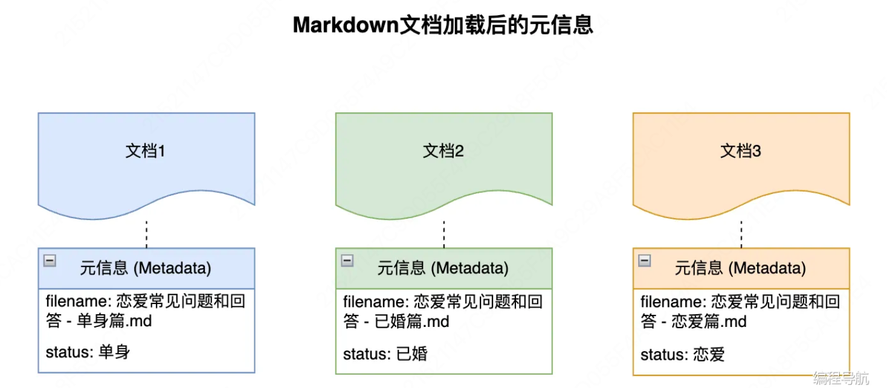

3)自动添加元信息:SpringAI提供了生成元信息的Transformer组件，可以基于AI自动解析关键词并添加到元信息中。代码如下:
```java
@Component
class MyKeywordEnricher {
    @Resource
    private ChatModel dashscopeChatModel;

    List<Document> enrichDocuments(List<Document> documents) {
        KeywordMetadataEnricher enricher = new KeywordMetadataEnricher(this.dashscopeChatModel, 5);
        return enricher.apply(documents);
    }
}

@Bean
VectorStore loveAppVectorStore(EmbeddingModel dashscopeEmbeddingModel) {
    SimpleVectorStore simpleVectorStore = SimpleVectorStore.builder(dashscopeEmbeddingModel)
            .build();
    // 加载文档
    List<Document> documents = loveAppDocumentLoader.loadMarkdowns();
    // 自动补充关键词元信息
    List<Document> enrichedDocuments = myKeywordEnricher.enrichDocuments(documents);
    simpleVectorStore.add(enrichedDocuments);
    return simpleVectorStore;
}
```
## 向量转换和存储
向量转换和存储是RAG系统的核心环节，直接影响检索的效率和准确性。
### 向量存储配置
需要根据费用成本、数据规模、性能、开发成本来选择向量存储方案，比如内存/Redis/MongoDB。

```java
SimpleVectorStore vectorStore = SimpleVectorStore.builder(embeddingModel)
.build();

```
在云平台中，通常提供多种存储选项，比如内置的向量存储或者云数据库:

### 选择合适的嵌入模型
嵌入模型负责将文本转换为向量，其质量直接影响相似度计算和检索准确性。可以在代码中修改:
```java
SimpleVectorStore vectorStore = SimplevectorStore.builder(embeddingModel).build();
```
云平台通常提供多种嵌入模型选项

## 文档过滤和检索
这个环节是我们开发者最能大显身手的地方，在技术已经确定的情况下，优化这个环节可以显著提升系统整体效果。
### 多查询扩展
在多轮会话场景中，用户输入的提示词有时可能不够完整，或者存在歧义。多查询扩展技术可以扩大检索范围，提高相关文档的召回率。
使用多查询扩展时，要注意:
设置合适的查询数量(建议3-5个)，过多会影响性能、增大成本·保留原始查询的核心语义
在编程实现中，可以通过以下代码实现多查询扩展:
```java
MultiQueryExpander queryExpander = MultiQueryExpander.builder()
    .chatClientBuilder(chatClientBuilder)
    .numberOfQueries(3)
    .build();
List<Query> queries = queryExpander.expand(new Query("谁是程序员鱼皮啊？"));
```
获得扩展查询后，可以直接用于检索文档、或者提取查询文本来改写提示词:
```java
DocumentRetriever retriever = VectorStoreDocumentRetriever.builder()
    .vectorStore(vectorStore)
    .similarityThreshold(0.73)
    .topK(5)
    .filterExpression(new FilterExpressionBuilder()
        .eq("genre", "fairytale")
        .build())
    .build();
// 直接用扩展后的查询来获取文档
List<Document> retrievedDocuments = documentRetriever.retrieve(query);
// 输出扩展后的查询文本
System.out.println(query.text());
```
多查询扩展的完整使用流程可以包括三个步骤:
1. 使用扩展后的查询召回文档:遍历扩展后的查询列表，对每个查询使用DocumentRetriever来召回相关文档。
2. 整合召回的文档:将每个查询召回的文档进行整合，形成一个包含所有相关信息的文档集合。(也可以使用文档合并器去重)
3. 使用召回的文档改写Prompt:将整合后的文档内容添加到原始Prompt中，为大语言模型提供更丰富的上下文信息。
需要注意，多查询扩展会增加查询次数和计算成本，效果也不易量化评估，所以个人建议慎用这种优化方式。
### 查询重写和翻译
查询重写和翻译可以使查询更加精确和专业，但是要注意保持查询的语义完整性。主要应用包括:

    使用 RewriteQueryTransformer 优化查询结构
    
    配置TranslationQueryTransformer 支持多语言
参考官方文档实现查询重写:
```java
@Component
public class QueryRewriter {

    private final QueryTransformer queryTransformer;

    public QueryRewriter(ChatModel dashscopeChatModel) {
        ChatClient.Builder builder = ChatClient.builder(dashscopeChatModel);
        // 创建查询重写转换器
        queryTransformer = RewriteQueryTransformer.builder()
                .chatClientBuilder(builder)
                .build();
    }

    public String doQueryRewrite(String prompt) {
        Query query = new Query(prompt);
        // 执行查询重写
        Query transformedQuery = queryTransformer.transform(query);
        // 输出重写后的查询
        return transformedQuery.text();
    }
}

```
```java
@Resource
  private QueryRewriter queryRewriter;

  public String doChatWithRag(String message, String chatId) {
      // 查询重写
      String rewrittenMessage = queryRewriter.doQueryRewrite(message);
      ChatResponse chatResponse = chatClient
              .prompt()
              .user(rewrittenMessage)
              .call()
              .chatResponse();
      String content = chatResponse.getResult().getOutput().getText();
      return content;
  }

```

## 检索器配置
检索器配置是影响检索质量的关键因素，主要包括三个方面:相似度阈值、返回文档数量和过滤规则。
### 1)设置合理的相似度阈值
相似度阈值控制文档被召回的标准，需根据具体问题调整:

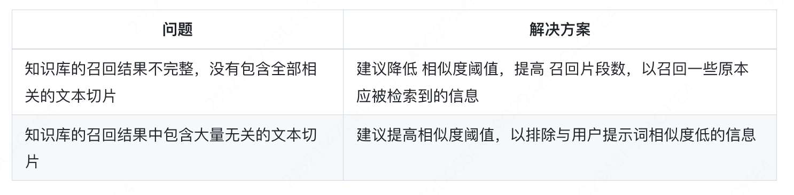

```java
DocumentRetriever documentRetriever = VectorStoreDocumentRetriever.builder()
        .vectorStore(loveAppVectorStore)
        .similarityThreshold(0.5) // 相似度阈值
        .build();
```

### 2)控制返回文档数量(召回片段数)
控制返回给模型的文档数量，平衡信息完整性和噪音水平。在编程实现中，可以通过文档检索器配置:
```java
DocumentRetriever documentRetriever = VectorStoreDocumentRetriever.builder()
        .vectorStore(loveAppVectorStore)
        .similarityThreshold(0.5) // 相似度阈值
        .topK(3) // 返回文档数量
        .build();
```
召回片段数即多路召回策略中的K值。系统最终会选取相似度分数最高的K个文本切片。不合适的K值可能导致RAG漏掉正确的文本切片，影响回答质量。
在多路召回场景下，如果应用关联了多个知识库，系统会从这些库中检索相关文本切片，然后通过重排序，选出
最相关的前K条提供给大模型参考。
### 3)配置文档过滤规则
通过文档过滤规则可以控制查询范围，提高检索精度和效率。主要应用场景:

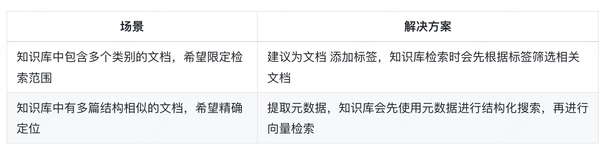

在编程实现中，运用Spring内置的文档检索器提供的filterExpression配置过滤规则。写一个工厂类LoveAppRagCustomAdvisorFactory，根据用户查询需求生成对应的advisor:
```java
@Slf4j
public class LoveAppRagCustomAdvisorFactory {
    public static Advisor createLoveAppRagCustomAdvisor(VectorStore vectorStore, String status) {
        Filter.Expression expression = new FilterExpressionBuilder()
                .eq("status", status)
                .build();
        DocumentRetriever documentRetriever = VectorStoreDocumentRetriever.builder()
                .vectorStore(vectorStore)
                .filterExpression(expression) // 过滤条件
                .similarityThreshold(0.5) // 相似度阈值
                .topK(3) // 返回文档数量
                .build();
        return RetrievalAugmentationAdvisor.builder()
                .documentRetriever(documentRetriever)
                .build();
    }
}
```
```java
chatClient.advisors(
    LoveAppRagCustomAdvisorFactory.createLoveAppRagCustomAdvisor(
        loveAppVectorStore, "已婚"
    )
)
```
不过阿里云DashScope文档检索器好像暂时不支持直接关联筛选表达式，鱼皮查了很久文档都没查到(使用云平台，目前百炼支持以下两种方式使用标签来实现过滤:

1.通过API调用百炼应用时，可以在请求参数 tags 中指定标签。

2.在控制台编辑应用时设置标签(但本方式仅适用于智能体应用)。请注意，此处的设置将应用于该智能体应用后续的所有用户问答。如图:

云百炼还支持元数据过滤，开启后，知识库会在向量检索前增加一层结构化搜索，完整过程如下:

    1.从提示词中提取元数据{"key”:"name"，"value”:"程序员鱼皮"}
    2.根据提取的元数据，找到所有包含该元数据的文本切片
    3.再进行向量(语义)检索，找到最相关的文本切片

通过APl调用应用时，可以在请求参数 metadata_filter中指定metadata。应用在检索知识库时，会先根据metadata筛选相关文档，实现精准过滤，参考官方文档。
最后，无论采用何种配置，都应多进行命中测试，验证检索效果:

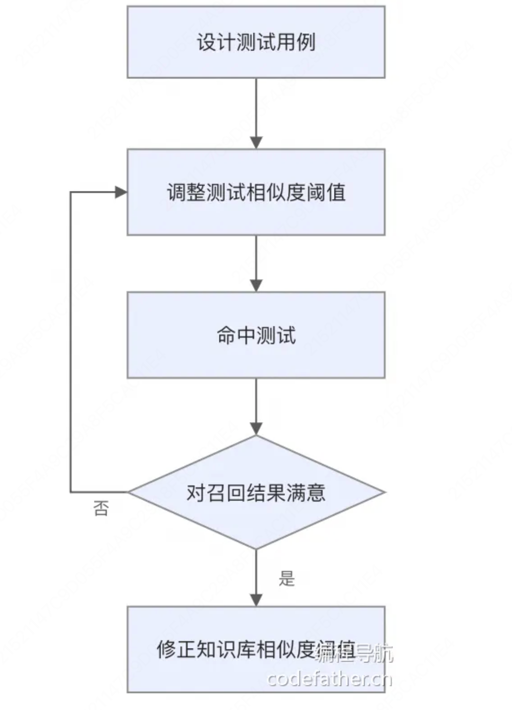

## 查询增强和关联
经过前面的文档检索，系统已经获取了与用户查询相关的文档。此时，大模型需要根据用户提示词和检索内容生成最终回答。然而，返回结果可能仍未达到预期效果，需要进一步优化。
### 错误处理机制
在实际应用中，可能出现多种异常情况，如找不到相关文档、相似度过低、查询超时等。良好的错误处理机制可以提升用户体验。
异常处理主要包括:

允许空上下文查询(即处理边界情况)

提供友好的错误提示

引导用户提供必要信息

边界情况处理可以使用 Spring AI的ContextualQueryAugmenter上下文查询增强器:

```java
RetrievalAugmentationAdvisor.builder()
    .queryAugmenter(
        ContextualQueryAugmenter.builder()
            .allowEmptyContext(false)
            .build()
    )
```
如果不使用自定义处理器，或者未启用"允许空上下文"选项，系统在找不到相关文档时会默认改写用户查询userText:

如果启用"允许空上下文”，系统会自动处理空Prompt情况，不会改写用户输入，而是使用原本的查询。

我们也可以自定义错误处理逻辑，来运用工厂模式创建一个自定义的ContextualQueryAugmenter:
```java
public class LoveAppContextualQueryAugmenterFactory {
    public static ContextualQueryAugmenter createInstance() {
        PromptTemplate emptyContextPromptTemplate = new PromptTemplate("""
                你应该输出下面的内容：
                抱歉，我只能回答恋爱相关的问题，别的没办法帮到您哦，
                有问题可以联系编程导航客服 https://codefather.cn
                """);
        return ContextualQueryAugmenter.builder()
                .allowEmptyContext(false)
                .emptyContextPromptTemplate(emptyContextPromptTemplate)
                .build();
    }
}

```
```java
RetrievalAugmentationAdvisor.builder()
              .documentRetriever(documentRetriever)
              .queryAugmenter(LoveAppContextualQueryAugmenterFactory.createInstance())
              .build();
```
## 其他建议
除了上述优化策略外，还可以考虑以下方面的改进:

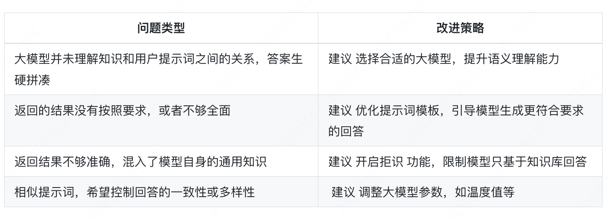

如果有必要的话，还可以考虑更高级的优化方向，比如:
1.  分离检索阶段和生成阶段的知识块
2.  针对不同阶段使用不同粒度的文档，进一步提升系统性能和回答质量
3.  针对查询重写、关键词元信息增强等用到AI大模型的场景，可以选择相对轻量的大模型，不一定整个项目只引入一种大模型:


# 三、扩展知识-RAG高级知识
## 混合检索策略
在RAG系统中，检索质量直接决定了最终回答的好坏。
而不同的检索方法各有优缺点:向量检索虽然能理解语义，捕捉文本间的概念关联，但对关键词敏感度不够。比如，当你搜索“2025年怎么学编程"时，向量检索可能会返回与编程相关的术语解释，而不是准确锁定2025年编程学习路线。
相反，基于倒排索引的全文检索在精确匹配关键词方面表现出色，但它不理解语义，难以处理同义词或概念性查询。就像你问“编程导航的创始人是谁"，全文检索可能不会返回只提到“程序员鱼皮创办了很多网站"而没有明确提到"编程导航"的文档。
结构化检索支持精确过滤和复杂条件组合，但依赖良好的元数据。而知识图谱检索能发现实体间隐含关系，适合回答复杂问题，但构建成本高。
主要检索方法比较表:

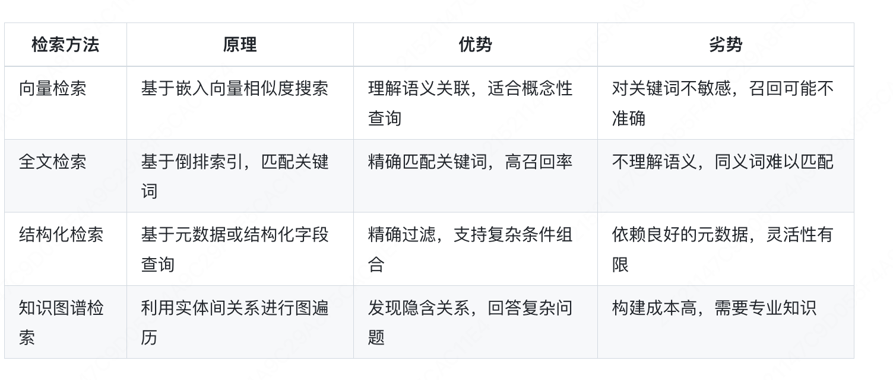

其中，全文检索是后端开发同学要掌握的技能，对应的主流技术实现是Elasticsearch，编程导航的聚合搜索平台项目和面试刷题平台项目都有Elasticsearch的实战讲解，感兴趣的同学可自行学习。
那么到底该选择哪种检索方法呢?
其实，就像我们查资料时会尝试不同的方法一样，单一的检索方法往往难以满足复杂的需求，那么就采取混合检
索策略。
混合检索策略的实现方式多种多样，主流的模式有下面3种，当然你也可以按需选择新的策略。
### 1、并行混合检索
同时使用多种检索方法获取结果，然后使用重排模型融合多来源结果。
像是同时派出多位专家寻找答案，然后整合他们的发现:

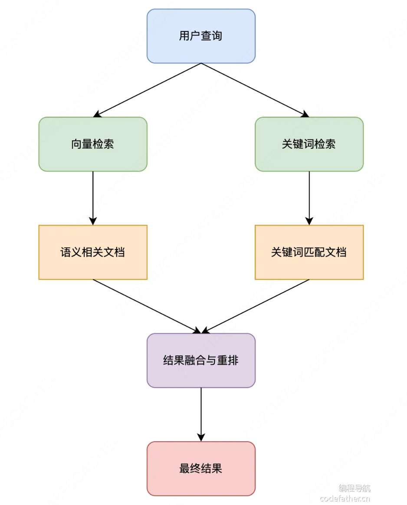

### 2、级联混合检索
层层筛选，先使用一种方法进行广泛召回，再用另一种方法精确过滤。
比如先用向量检索获取语义相似文档，再用关键词过滤，最后用元数据进一步筛选，逐步缩小范围。

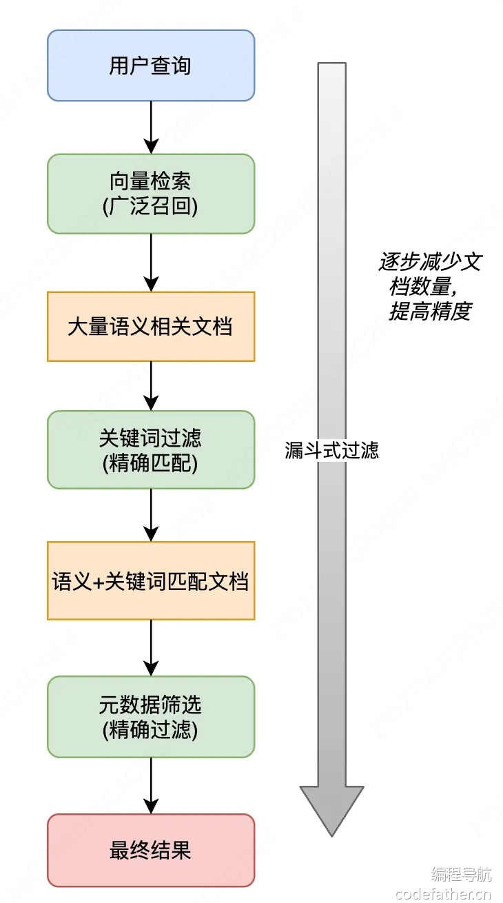

### 3、动态混合检索
通过一个"路由器”，根据查询类型自动选择最合适的检索方法，更加智能。举个例子，对于"谁是鱼皮"这样的人物查询，可能偏向使用知识图谱;而处理“如何编写Java项目"这类教程问题，可能更适合向量检索配合全文搜索。这种方法让系统能像人类一样智能地选择最佳信息获取途径。

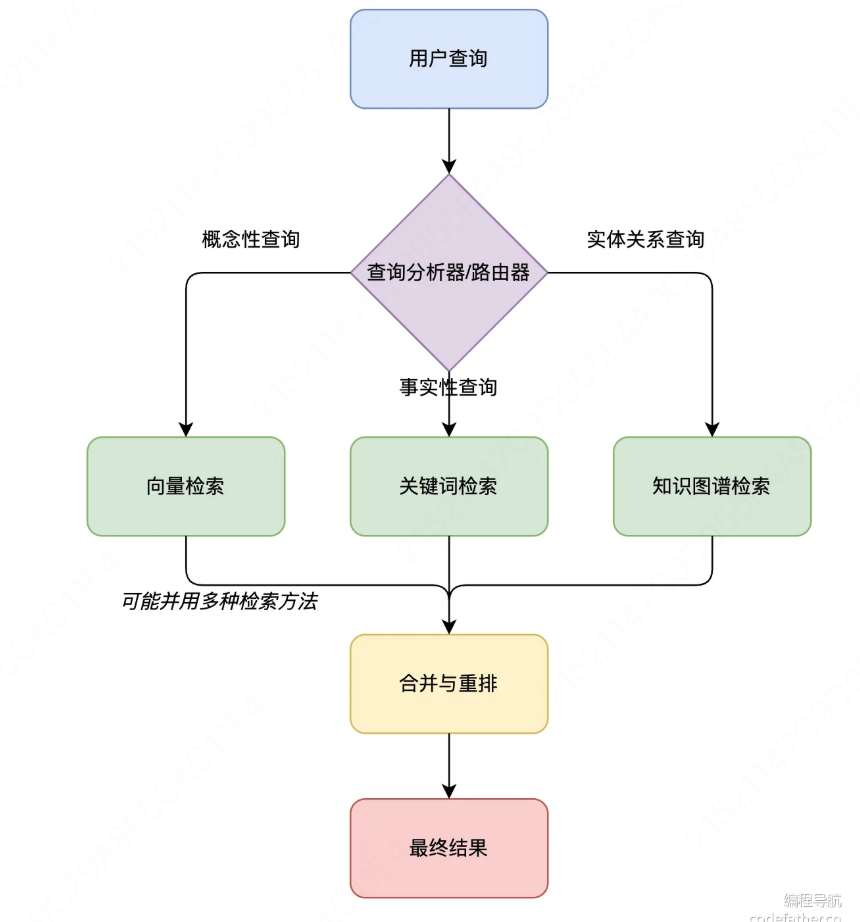

# 大模型幻觉
大模型有时会"自信满满地胡说八道”，这就是大模型的经典问题-幻觉。
比如下面这个例子，鱼皮的真名可不是“李逸轩”!

大模型幻觉指的是模型生成看似合理但实际上不准确或完全虚构的内容。就像一个信心十足的学生回答了一个自己并不真正了解的问题。这些幻觉主要有三种表现形式:
1.  事实性幻觉:生成与事实不符的内容(如错误的日期、人物关系等)。比如“鱼皮发明了计算器’
2.  逻辑性幻觉:推理过程存在逻辑错误，得出不合理的结论。比如"1+1=3”
3.  自洽性幻觉:生成内容自身存在矛盾。比如“我很年轻，才80岁”

为什么会出现幻觉呢?

原因其实很复杂。一方面，模型的训练数据中可能包含错误或过时的信息;另一方面，大语言模型本质上是预测下一个词的概率模型，它们倾向于生成流畅而未必准确的内容。更重要的是，模型并不真正“知道"什么，它只是学会了文本的统计模式。
想象一下，当你问一个从来没去过月球的人关于月球表面的情况，他可能会基于看过的电影或书籍给出看似合理但不准确的描述。大模型的幻觉本质上与此类似。

那么，如何减少这种幻觉呢?

首先就是我们重点学习的RAG，通过引入外部知识源，我们可以让模型不再完全依赖其参数中存储的信息，而是基于检索到的最新、准确的信息来回答问题。

有效的RAG实现通常会引入“引用标注"机制，让模型明确指出信息来源于哪个文档的哪个部分。当模型不确定时，我们也应该鼓励它诚实地表达不确定性，而不是猜测答案。这就像一个好的学者会明确引用来源，并在不确定时坦诚承认知识的局限性。

此外，还有其他减轻幻觉的方法，比如提示工程优化，可以采用"思维链"提高推理透明度，通过引导模型一步步思考，我们能够更好地观察其推理过程，及时发现可能的错误。很多Agent超级智能体都会采用这种模式:

此外，我们还可以使用事实验证模型检查生成内容的准确性，建立关键信息的自动核查机制，或实施人机协作的审核流程。评估幻觉程度的指标包括事实一致性、引用准确性和自洽性评分。通过上面的方法，我们能够大幅减轻大模型幻觉，提供更可靠的AI使用体验。

# RAG应用评估
开发一个RAG系统并不难，难的是如何确保它真正有效。如果是我们自己学习RAG应用或者开发小产品，直接用云平台提供的命中测试能力就可以评估RAG的效果。

但是对于大公司或精心打磨AI产品的团队来说，一般会建设一套科学的评估体系。

RAG应用评估本质上回答了3个关键问题:

1) 系统检索的信息是否相关?
2) 生成的回答是否准确?
3) 整体用户体验如何?

评估的目的是确保回答质量、识别性能瓶颈，从而给出持续优化的思路。
我们可以简单了解下RAG应用的评估指标:

检索质量评估指标

    召回率:能否检索到所有相关文档
    精确率:检索结果中相关文档的比例
    平均精度均值(MAP):考虑排序质量的综合指标
    规范化折扣累积增益(NDCG):考虑到文档的相关性和它们在排名中的位置，是一个衡量排名质量的指标

生成回答质量评估指标

    事实准确性:回答中事实性陈述的准确程度
    答案完整性:回答是否涵盖问题的所有方面
    上下文相关性:回答与问题的相关程度
    引用准确性:引用内容是否确实来自检索上下文

当然，我们还可以根据具体应用场景，定制专门的评估标准。比如系统性能评估、领域适应性评估、多语言评估、时效性评估和用户满意度评估。其中，用户满意度评估在我们开发AI产品时尤为常见，经常需要引导用户针对AI大模型的回复进行打分。

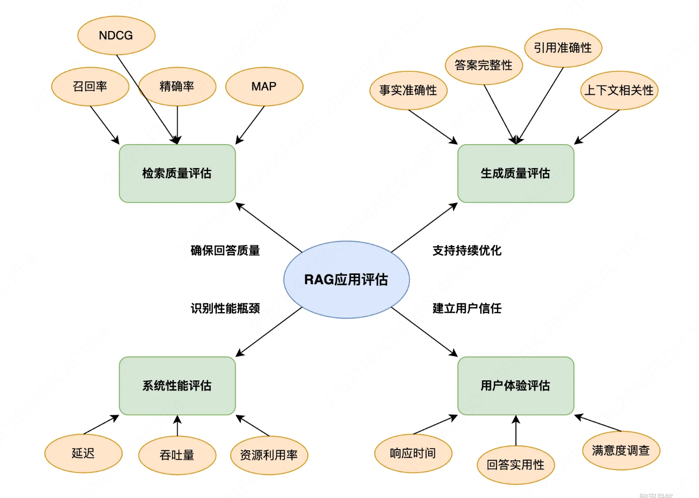

RAG评估流程通常包括4个步骤:

1.生成评估数据集:创建覆盖不同问题类型的测试集，为每个问题准备标准答案和相关文档。这些测试问题应包括事实性问题、观点性问题、多步骤推理问题等各种类型。

2.运行评估检索过程的程序:对每个测试问题执行检索，与人工标注的相关文档比较，计算检索性能指标。

3.评估回答质量:实际操作中，评估通常分为自动评估和人工评估两种方式。自动评估使用像ROUGE(召回率取向摘要评估)或BLEU(双语评估替补)这样的指标来衡量生成内容与参考答案的相似度，或者使用更强大的模型来判断回答质量。但自动评估有其局限性，某些方面如创造性、实用性等仍然需要人工评估。这就是为什么很多AI公司会招人来人工标注。

4.综合分析与优化:识别失败模式和常见错误，比如区分检索失败和生成失败，针对性改进系统组件。

如果面试时，面试官问到"你是如何评估和调优RAG系统的?"，就可以采用下面这样的回答:
我曾参与过一个编程咨询RAG系统的评估和优化。系统在回答具体编程技术问题时表现出色，但处理“根据个人编程情况给出学习建议"的复杂案例时表现不好。通过错误分析，我们发现问题出在检索阶段--系统无法同时检索到相关技术知识和类似的学习建议。针对这一问题，我们调整了检索策略，专门为学习建议类问题设计了基于案例的检索方法，从而提升了模型回复的准确度。

# 高级RAG架构
有时，传统的“检索-生成"架构可能无法满足更复杂、要求质量更高的需求，因此让我们简单了解几种创新的RAG架构，重点要了解每种架构的应用场景，如果真的要深入学习，建议在网上搜索相关论文。

## 1、自纠错RAG(C-RAG)
解决了模型可能误解或错误使用检索信息的问题，提高回答的准确性。

想象一下，你给朋友讲述一个你刚读过的新闻，但不小心添加了一些自己的理解或记错了细节，C-RAG就是为了解决这个问题而设计的。
C-RAG采用“检索-生成-验证-纠正"的闭环流程:先检索文档，生成初步回答，然后验证回答中的每个事实陈述，发现错误就立即纠正并重新生成。这种循环确保了最终回答的高度准确性，特别适合医疗、法律等对事实准确性要求极高的领域。

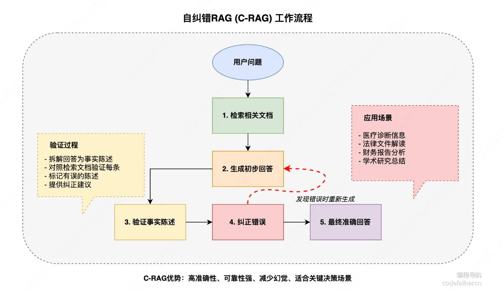

## 2、自省式RAG(Self-RAG)
解决了"并非所有问题都需要检索"的问题，让回答更自然并提高系统效率。

想象你问”1+1等于几”这样的基础问题，模型完全可以直接回答，无需额外检索。Self-RAG让模型学会了判断:什么时候需要查资料、什么时候可以直接回答。
收到提问时，Self-RAG模型会在内心思考:"这个问题我知道答案吗?需要查询更多信息吗?我的回答包含任何不确定的内容吗?"这种自我反思机制使回答更加自然，也可以在一定程度上提高系统效率。

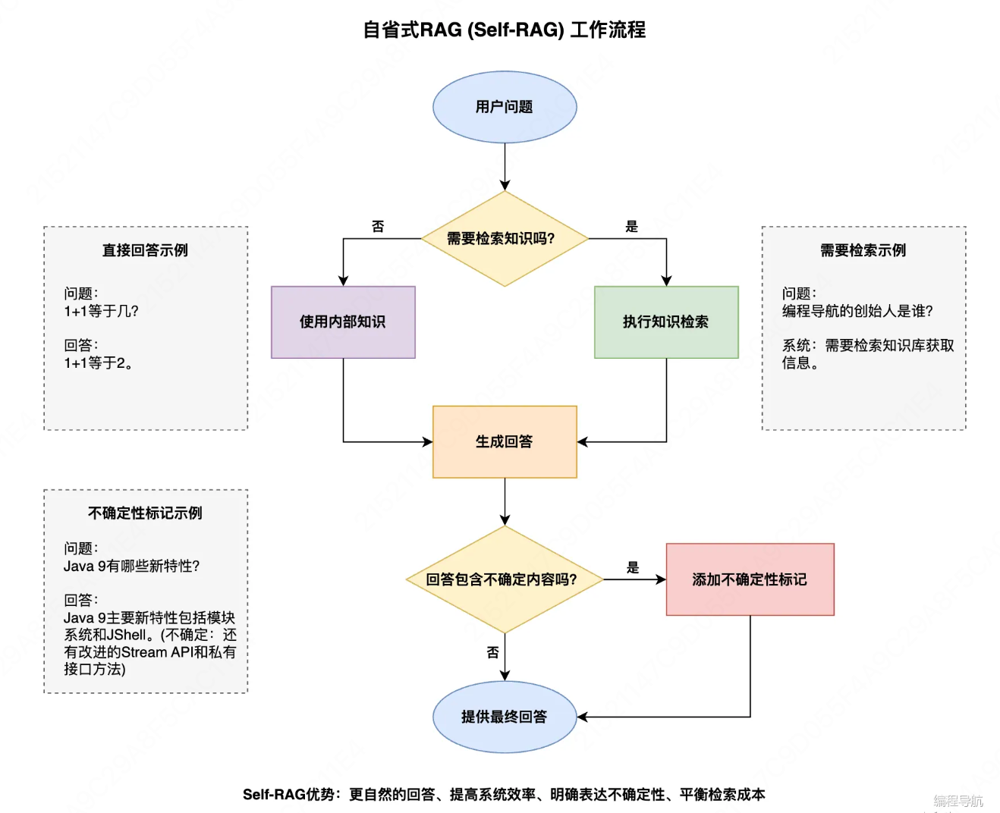

## 3、检索树RAG(RAPTOR)
提供了一种结构化的解决方案，特别适合可拆分的复杂问题。它就像解决一个复杂数学题:先把大问题分解成小问题，分别解决每个小问题，然后将答案整合起来。

举个例子，对于“介绍编程导航的交流板块、学习板块和教程板块”这样的多方面问题，RAPTOR会分别检索关于3个板块的信息，然后综合这些信息形成最终回答。这种方法特别适合需要整合多方面知识的复杂问题，能够提高长篇叙述的连贯性和准确性，克服单次检索的上下文长度限制

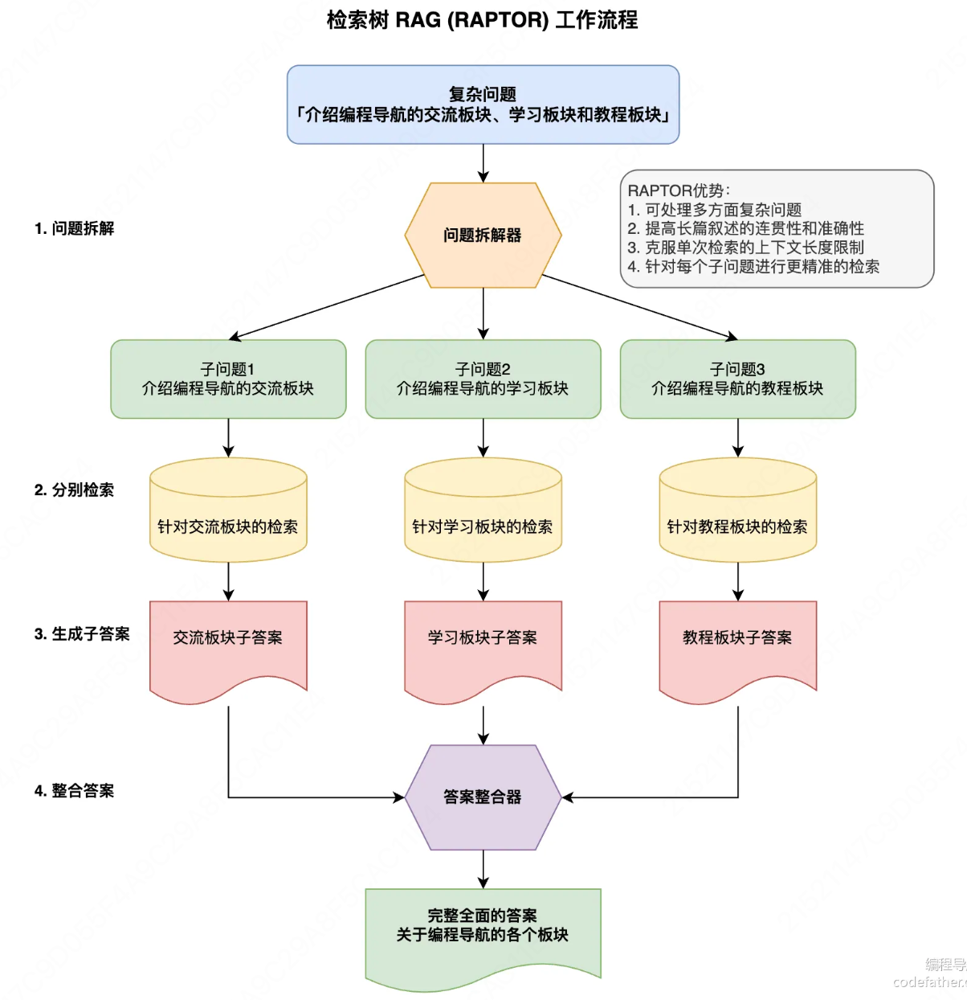

## 4、多智能体RAG系统
组合拥有各类特长的智能体，通过明确的通信协议交换信息，实现复杂任务的协同处理。也就是让专业的大模型做专业的事情。

还是类比到现实生活，假设某个团队要解决问题。团队中有专门负责理解用户意图的接待员，有擅长搜索文档的资料管理员，有精通特定领域知识的专家，还有负责事实核查的审核员和润色最终回答的编辑。比起一个人做事，各司其职相互配合效果可能会更好。

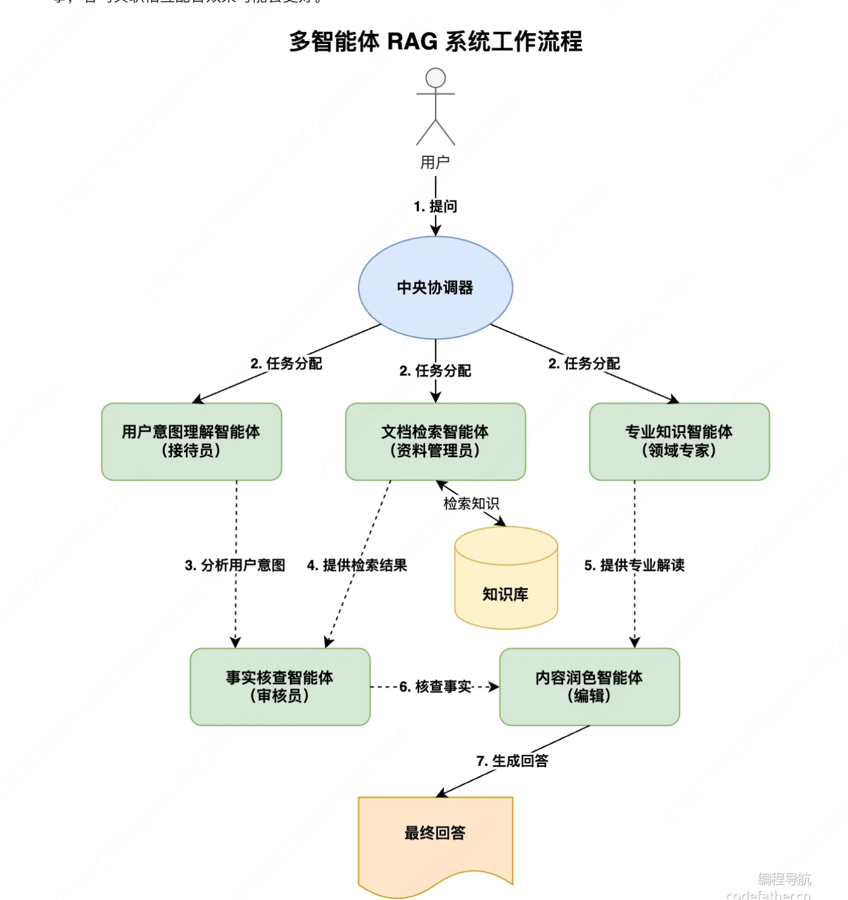

在实际应用中，这些高级架构往往不是独立使用的，而是根据具体需求灵活组合。比如金融顾问系统可能在处理般市场趋势问题时使用Self-RAG，而在回答具体公司财务数据时使用C-RAG，对于复杂的投资组合分析则采用RAPTOR架构进行多维度分析。

RAG技术还在不断演进，未来将向多模态(整合文本、图像、音频等)、适应性(根据用户反馈动态调整)和更高效率的方向发展。核心挑战始终是如何精准检索知识并无缝融入生成过程，为用户提供既准确又自然的AI回答体验。


# 四、扩展思路

1) 自定义DocumentReader 文档读取器，比如读取GitHub 仓库信息。可以参考Spring AI Alibaba 官方开源的 代码仓库来了解

2) 自定义QueryTransformer查询转换器，比如利用第三方翻译 API代替Spring AI内置的基于大模型的翻译工具，从而降低成本。
   
3) 实现基于向量数据库和其他数据存储(比如MySQL、Redis、Elasticsearch)的混合检索。实现思路可以是整合多数据源的搜索结果;或者把其他数据存储作为降级方案，从向量数据库中查不到数据时，再从其他数据库中查询。
   
4) 不借助Spring AI等开发框架，自主实现RAG;或者自主实现一个Spring AI的RAG Advisor，从而加深对RAG实现原理的理解。


