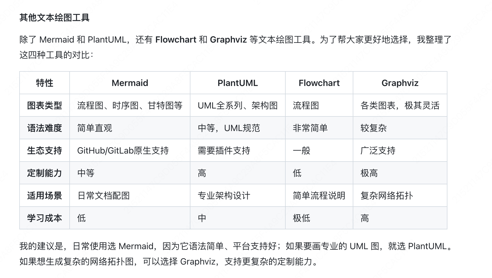

# 工具库
还有一些开发AI智能体时会用到的工具库，比如:
Apache Tika，一款功能强大的文件解析器工具库，支持解析PDF、Word、Excel、PowerPoint等各种文档，然后提供给AI作为知识。
Playwright，用于模拟浏览器行为的工具库，AI需要运行网页、抓取网页数据、自动化测试时，它都能派上用场。
JSON格式解析库GSON和Kryo
HTML文档解析库jsoup
这些类库基本没什么学习成本，要用的时候看文档就好了。

# 部署工具
项目最终是要部署上线的嘛，所以我们还要掌握高效的部署工具，让AI应用从开发环境顺利过渡到生产环境，为用户提供稳定服务。
如果不在意价格、追求稳定的话，还是优先选择大厂提供的云服务来部署项目。但如果是个人学习使用、想快速上线自己的AI小应用，可以试试下面这些平台:

Vercel:[https://vercel.com/]适合前端应用的部署平台，支持自动构建、在线浏览、CDN分发，而且还免费提供可访问的域名·

Sealos:[https://sealos.io/]云原生应用管理平台，支持Kubernetes集群管理，为AI应用提供容器化部署环境，适合需要弹性伸缩的AI服务

Railway:[https://railway.com/]能让开发人员轻松部署Docker容器，无需操心服务器配置与运维，且自带自动化构建工具、环境管理能力等


# 文本绘图
文本绘图是最受高级程序员欢迎的画图方式，通过简单的文本描述就能生成专业的技术图。主流的文本绘图语言包括Mermaid和PlantUML，它们各有特色，适用于不同的场景。

## 1、Mermaid -最流行的文本绘图工具
Mermaid是目前最流行的文本绘图工具，语法简单直观，被GitHub、语雀等大平台原生支持。无论你是要画软件架构图、业务流程图，还是数据库ER图、Git分支图，Mermaid都能轻松搞定。
让我们先来画一个用户登录流程图，只需要给AI这样的提示词

```请用 Mermaid 语法帮我画一个用户登录流程图，包含以下步骤：
   1. 用户输入账号密码
   2. 前端校验格式
   3. 发送请求到后端
   4. 后端验证用户信息
   5. 如果验证成功，生成 token 返回
   6. 如果失败，返回错误信息
   7. 前端根据结果跳转页面或显示错误
```

## 2、PlantUML-专业的UML绘图工具
PlantUML是另一个强大的文本绘图工具，特别擅长绘制UML图、时序图和系统架构图。它的语法相对Mermaid更加专业和规范，生成的图表也更加精美。
让我们用AI+PlantUML画一个经典的订单系统类图，给AI的提示词如下:
```
请用PlantUML 语法帮我画一个订单系统的类图，包含:- 0rder类:订单ID、用户ID、总金额、状态、创建时间
- 0rderItem类:商品ID、数量、单价
- User类:用户ID、用户名、邮箱
- Product类:商品ID、名称、价格、库存
  展示它们之间的关联关系。
  AI会生成专业的PlantUML代码，同样放到语雀的文本绘图、或者PlantUML渲染网站中，都可以看到效果:
```

## 其他绘画工具



## 网页绘图
网页绘图是一种非常自由灵活的绘图方式。
本质上是“图片即网站”--通过生成包含可视化元素的网页代码，在浏览器中渲染出各种图片，而且可以实现静态图片无法做到的交互效果和动画展示。 

1、原生网页绘图
利用网站开发的核心技术(HTML+CSS+JavaScript)，
我们可以生成各种类型的图表。这种方式虽然不是传统意义上的绘图，但效果可能会超出预期。
还可以借助各种第三方可视化库(如ECharts、D3.js等)来增强效果。
举个例子，当需要展示数据时，Al可以利用Apache ECharts等可视化库生成专业的数据大屏。
给AI的提示词如下:

```commandline

请生成一个数据可视化大屏页面，展示电商平台的实时数据：
1. 页面布局：深色背景的大屏风格，分为头部标题和多个数据展示区域
2. 包含以下图表：
   - 实时销售额（动态数字翻牌效果）
   - 各品类销售占比（饼图）
   - 24小时销售趋势（折线图）
   - 热销商品TOP10（柱状图）
   - 用户地域分布（中国地图热力图）
3. 使用 ECharts 实现，要有动画效果
4. 响应式布局，适配不同屏幕

```

还可以通过[https://codepen.io/] 等工具分享给别人


## 2、SVG矢量图绘制
SVG是可缩放的矢量图形，SVG图像可以无限缩放而不失真，非常适合绘制UI素材、Logo图标、图形插画、技术架构图、流程图等需要无损缩放的图片。

SVG文件本质上是XML格式的文本代码，可以直接嵌入网页或导入各种设计工具。让我们用SVG绘制一个系统架构图，给AI的提示词如下:

```commandline
请生成一个 SVG 格式的系统架构图，展示一个典型的三层架构：
- 展示层：Web 前端、移动端 App
- 业务层：API 服务器集群（3个节点）
- 数据层：主从数据库、Redis 缓存
要求：
- 使用不同颜色区分各层
- 添加连接线表示数据流向
- 图形美观，配色专业

```

## 3、Canvas动态绘图
Canvas是HTML5提供的一个画布元素，通过JavaScript 可以在上面绘制各种图形。
与SVG不同，Canvas是基于像素的，而且性能优秀，适合创建需要精确控制元素细节、动画效果丰富的画面，很多游戏也是基于Canvas实现的。
让我们利用Al+Canvas绘制一个海报页面，给AI的提示词如下:

```commandline
请用 HTML5 Canvas 创建一个商务风格的宣传海报：
- 主题：企业网络解决方案
- 布局：上下分层设计，上部分为图形区域，下部分为文字区域
- 核心图形：5个立体感服务器图标，用优雅的曲线连接
- 配色：蓝白配色方案，体现专业感
- 文字内容：公司 Logo、产品名称、核心卖点
- 视觉效果：微妙的阴影和高光，提升质感
- 输出格式：可打印的高分辨率海报
```


